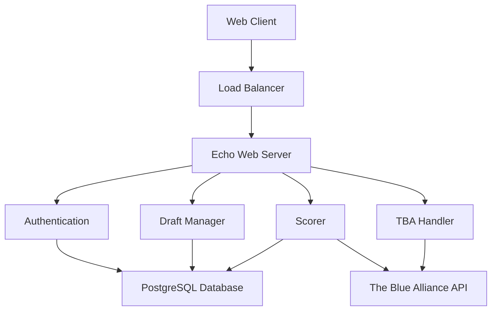

# Fantasy FRC Web Documentation

Welcome to the comprehensive documentation for the Fantasy FRC web application.

## 📚 Documentation Index

### [🏗️ Architecture](./architecture/)
- [System Overview](./architecture/system-overview.md) - High-level architecture and components
- [Component Interactions](./architecture/component-interactions.md) - How subsystems communicate
- [Data Flow](./architecture/data-flow.md) - Data movement through the system

### [🔌 API](./api/)
- [Web Endpoints](./api/web-endpoints.md) - HTTP endpoints and forms
- [WebSocket API](./api/websocket-api.md) - Real-time notifications

### [🗄️ Database](./database/)
- [Schema](./database/schema.md) - Database structure and relationships
- [Schema Visual Guide](./database/schema-visual.md) - Visual database diagrams

### [🚀 Environment Setup](./development/setup.md)
- Development environment configuration
- Prerequisites and tool installation

### [💼 Business Logic](./business-logic/)
- [Scoring Algorithm](./business-logic/scoring.md) - How points are calculated
- [Scoring Visual Guide](./business-logic/scoring-visual.md) - Scoring system diagrams
- [Draft States](./business-logic/draft-states.md) - Draft state machine
- [Draft State Visual Guide](./business-logic/draft-states-visual.md) - Draft lifecycle diagrams

### [🎮 User Guide](./user-guide/)
- [Getting Started](./user-guide/getting-started.md) - How to play Fantasy FRC
- [Draft Process](./user-guide/draft-process.md) - Complete draft walkthrough
- [Scoring Explained](./user-guide/scoring-explained.md) - How points work
- [Strategy Tips](./user-guide/strategy-tips.md) - Build winning teams

### [👨‍💻 Development](./development/)
- [Setup Guide](./development/setup.md) - Development environment
- [Development Overview](./development/README.md) - Development workflow and standards

## 🎯 Quick Start
1. **For Players**: Start with [Getting Started](./user-guide/getting-started.md)
2. **For Draft Commissioners**: See [Draft Process](./user-guide/draft-process.md)
3. **For Developers**: Start with [Development Setup](./development/setup.md)
4. **For API Users**: See [Web Endpoints](./api/web-endpoints.md)
5. **For Database Setup**: See [Database Schema](./database/schema.md)
6. **For System Architecture**: See [System Overview](./architecture/system-overview.md)

## 📊 System Overview

*Last updated: 2025-12-11*
