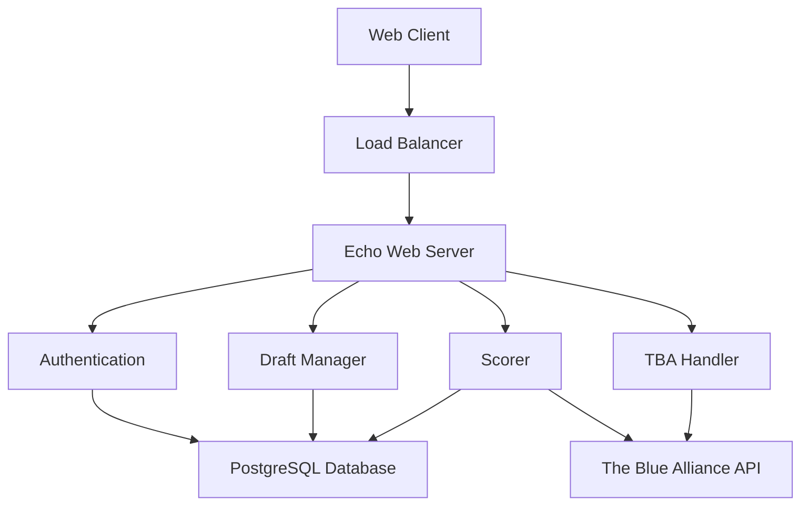

# Fantasy FRC Web Documentation

Welcome to the comprehensive documentation for the Fantasy FRC web application.

## 📚 Documentation Index

### [🏗️ Architecture](./architecture/)
- [System Overview](./architecture/system-overview.md) - High-level architecture and components
- [Component Interactions](./architecture/component-interactions.md) - How subsystems communicate
- [Data Flow](./architecture/data-flow.md) - Data movement through the system

### [🔌 API](./api/)
- [REST API](./api/rest-api.md) - Complete API reference
- [WebSocket API](./api/websocket-api.md) - Real-time notifications
- [Error Handling](./api/error-handling.md) - Error codes and responses

### [🗄️ Database](./database/)
- [Schema](./database/schema.md) - Database structure and relationships
- [Schema Visual Guide](./database/schema-visual.md) - Visual database diagrams

### [🚀 Environment Setup](./development/setup.md)
- Development environment configuration
- Prerequisites and tool installation
- Local development workflow

### [💼 Business Logic](./business-logic/)
- [Scoring Algorithm](./business-logic/scoring.md) - How points are calculated
- [Scoring Visual Guide](./business-logic/scoring-visual.md) - Scoring system diagrams
- [Draft States](./business-logic/draft-states.md) - Draft state machine
- [Draft State Visual Guide](./business-logic/draft-states-visual.md) - Draft lifecycle diagrams

### [👨‍💻 Development](./development/)
- [Setup Guide](./development/setup.md) - Development environment
- [Development Overview](./development/README.md) - Development workflow and standards

### [⚙️ Operations](./operations/) *(Coming Soon)*
- [Monitoring](./operations/monitoring.md) - System monitoring
- [Troubleshooting](./operations/troubleshooting.md) - Common issues

## 🎯 Quick Start

1. **For Developers**: Start with [Development Setup](./development/setup.md)
2. **For API Users**: See [REST API](./api/rest-api.md)
3. **For Database Setup**: See [Database Schema](./database/schema.md)
4. **For System Architecture**: See [System Overview](./architecture/system-overview.md)

## 📊 System Overview

## 🔗 Related Resources

- [Main README](../README.md)
- [Development Guidelines](../AGENTS.md)
- [Code of Conduct](../CODE_OF_CONDUCT.md)
- [Security Policy](../SECURITY.md)

---

*Last updated: 2025-12-11*