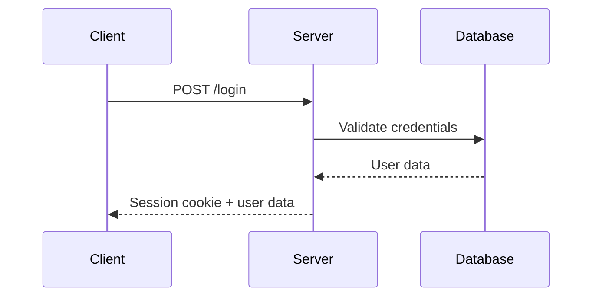
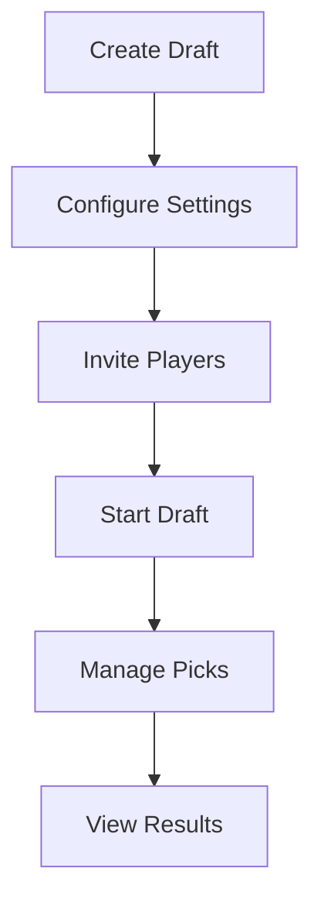

# Web Application Routes

Complete reference for the Fantasy FRC web application HTTP routes and HTML responses.

## 🔌 Base URL
```
https://your-domain.com
```

## 📋 Application Overview

### Architecture
This is a server-rendered web application using:
- **Framework**: Echo v4 HTTP server
- **Templating**: Templ for server-side HTML generation
- **Authentication**: Session-based with secure cookies
- **Real-time**: WebSocket for live updates

### Response Format
All routes return HTML pages using server-side rendering, except for:
- **POST endpoints**: May redirect or return HTML with status messages
- **WebSocket**: Real-time JSON messages for live updates
- **Static assets**: CSS, JavaScript, images served directly

### Authentication
All protected routes (`/u/*`) require a valid session cookie. Public routes are accessible without authentication.

## 🌐 Public Endpoints

### Authentication


#### POST /login
Authenticate user and create session.

**Request Body:** Form data (`application/x-www-form-urlencoded`)
```
username=player1&password=secret123
```

**Response:** HTTP 302 redirect to `/u/home` on success, or login page with error message on failure.

#### POST /register
Create new user account.

**Request Body:** Form data
```
username=newplayer&password=secret123
```

**Response:** HTTP 302 redirect to `/u/home` on success, or registration page with error message.

#### POST /logout
Terminate user session.

**Response:** HTTP 302 redirect to `/`

#### GET /login
Render login page HTML.

**Template:** `server/view/login/login.templ`

#### GET /register
Render registration page HTML.

**Template:** `server/view/login/register.templ`

### Landing Pages
#### GET /
Landing page for unauthenticated users.

## 🔐 Protected Endpoints (`/u/*`)

### User Dashboard
#### GET /u/home
User's main dashboard with drafts and invitations.

**Response:** HTML page rendered with user's drafts and invitations.

**Template:** `server/view/home.templ`

**Data Context:**
- Owned drafts (user is draft owner)
- Participating drafts (user is player)
- Pending invitations
- Recommended public drafts

### Draft Management


#### GET /u/createDraft
Get draft creation form.

#### POST /u/createDraft
Create new draft.

**Request Body:**
```json
{
  "displayName": "string",
  "description": "string",
  "startTime": "2025-12-11T10:00:00Z",
  "endTime": "2025-12-11T12:00:00Z",
  "interval": 120
}
```

#### GET /u/draft/:id/profile
Get draft management page.

#### POST /u/draft/:id/updateDraft
Update draft settings.

#### POST /u/draft/:id/startDraft
Initiate draft picking phase.

### Draft Participation
#### GET /u/draft/:id/pick
Get picking interface for current turn.

#### POST /u/draft/:id/makePick
Submit team selection.

**Request Body:**
```json
{
  "teamTbaId": "frc1234"
}
```

#### GET /u/draft/:id/pickNotifier
WebSocket endpoint for real-time draft updates.

### Player Management
#### POST /u/draft/:id/invitePlayer
Invite player to draft.

**Request Body:**
```json
{
  "username": "player2"
}
```

#### GET /u/viewInvites
Get pending draft invitations.

#### POST /u/acceptInvite
Accept draft invitation.

**Request Body:**
```json
{
  "draftId": 456
}
```

### Scoring and Results
#### GET /u/team/score
Get team scoring interface.

#### POST /u/team/score
Get team scores for specific teams.

**Request Body:**
```json
{
  "teamTbaIds": ["frc1234", "frc5678"]
}
```

#### GET /u/draft/:id/draftScore
Get draft scoring results.

### Search and Discovery
#### POST /u/searchPlayers
Search for users to invite.

**Request Body:**
```json
{
  "query": "player"
}
```

#### GET /u/reccomendedDraft
Get recommended public drafts.

### Draft Controls
#### POST /u/draft/:id/skipPickToggle
Toggle auto-skip for current pick.

## 👑 Admin Endpoints (`/u/admin/*`)

#### GET /u/admin/console
Get administrative dashboard.

#### POST /u/admin/processCommand
Execute administrative commands.

**Request Body:**
```json
{
  "command": "string",
  "parameters": {}
}
```

## 🌐 Webhook Endpoints

#### POST /tbaWebhook
Receive webhook events from The Blue Alliance.

**Headers:**
- `X-TBA-Auth-Key`: TBA API authentication

**Request Body:** Varies by event type.

## ❌ Error Handling

### Standard Error Response
```json
{
  "success": false,
  "data": null,
  "error": {
    "code": "VALIDATION_ERROR",
    "message": "Invalid input data",
    "details": {
      "field": "username",
      "issue": "Username already exists"
    }
  }
}
```

### Common Error Codes
| Code | HTTP Status | Description |
|------|-------------|-------------|
| `VALIDATION_ERROR` | 400 | Invalid request data |
| `UNAUTHORIZED` | 401 | Authentication required |
| `FORBIDDEN` | 403 | Insufficient permissions |
| `NOT_FOUND` | 404 | Resource not found |
| `CONFLICT` | 409 | Resource state conflict |
| `INTERNAL_ERROR` | 500 | Server error |

### Draft-Specific Errors
| Code | Description |
|------|-------------|
| `DRAFT_NOT_FOUND` | Draft does not exist |
| `NOT_DRAFT_OWNER` | User does not own draft |
| `DRAFT_ALREADY_STARTED` | Draft cannot be modified |
| `INVALID_PICK` | Team selection invalid |
| `PICK_EXPIRED` | Pick time limit exceeded |
| `TEAM_ALREADY_PICKED` | Team already selected |

## 📊 Rate Limiting

- **Authentication**: 5 requests per minute
- **Draft Operations**: 60 requests per minute
- **Search**: 20 requests per minute
- **Webhooks**: No limit (server-to-server)

## 🔄 API Versioning

Current version: `v1`

Version specified in URL path:
```
/api/v1/drafts
```

---

*TODO: Add detailed request/response examples, authentication flow diagrams, and client SDK documentation*