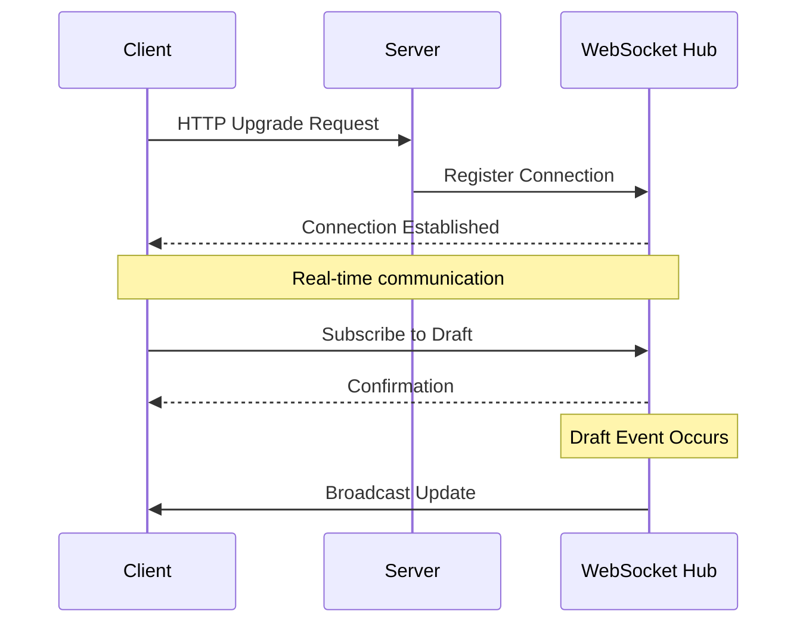
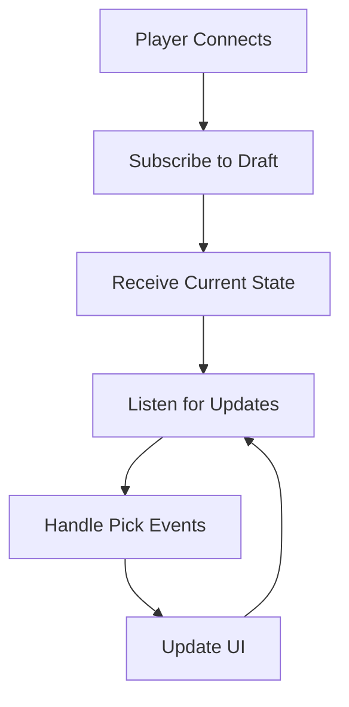
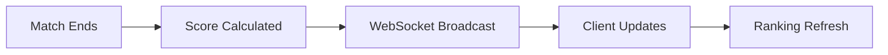
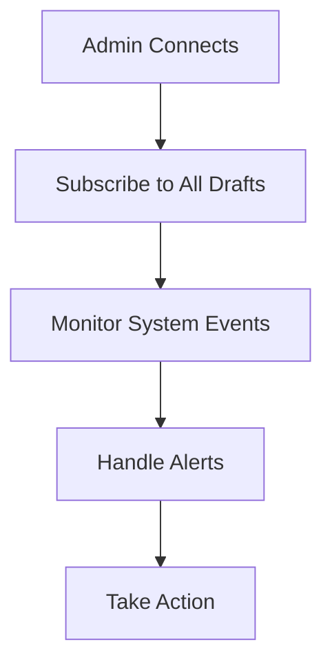

# WebSocket API

Real-time communication protocol for live draft updates and notifications.

## 🔌 WebSocket Connection

### Endpoint
```
wss://your-domain.com/u/draft/:id/pickNotifier
```

### Authentication
WebSocket connections inherit authentication from the HTTP session that establishes them.

### Connection Flow


## 🎯 Use Cases

### Draft Room Interface


### Live Scoreboard


### Admin Monitoring


*TODO: Add complete client SDK documentation, advanced error handling patterns, and performance benchmarking data*
