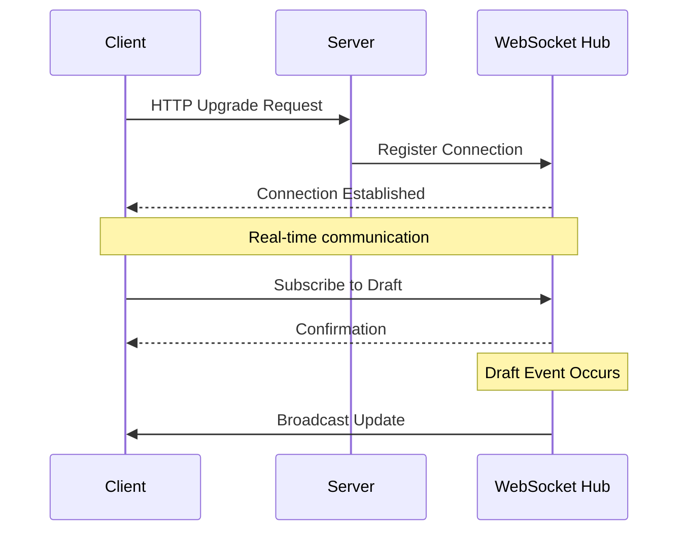
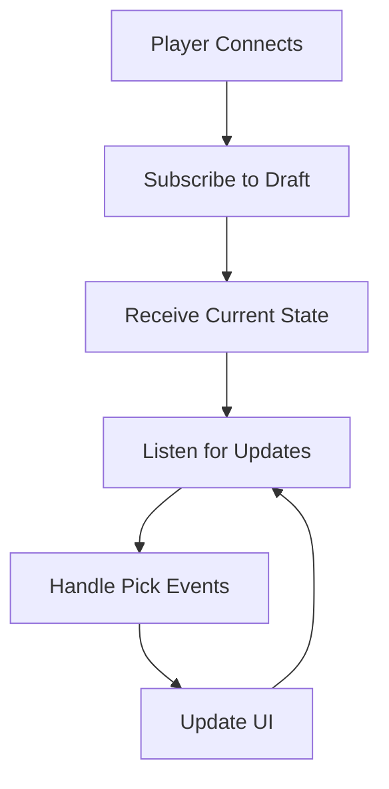
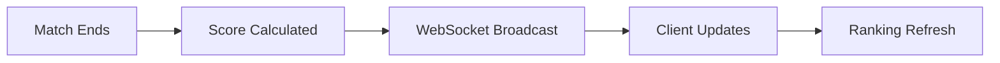
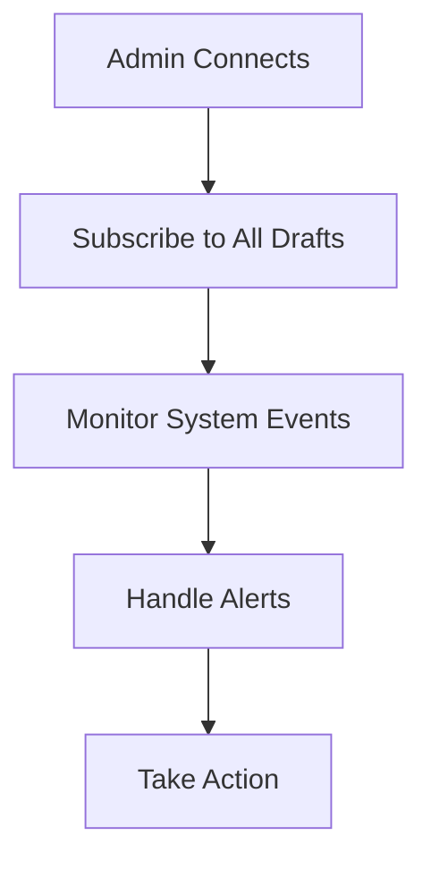

# WebSocket API

Real-time communication protocol for live draft updates and notifications.

## 🔌 WebSocket Connection

### Endpoint
```
wss://your-domain.com/u/draft/:id/pickNotifier
```

### Authentication
WebSocket connections inherit authentication from the HTTP session that establishes them.

## 📡 Message Protocol

### Message Format
All WebSocket messages use JSON format:
```json
{
  "type": "string",
  "data": {},
  "timestamp": "2025-12-11T10:30:00Z",
  "draftId": 123
}
```

### Connection Flow


## 📢 Event Types

### Draft State Changes
#### `DRAFT_STATE_CHANGED`
Draft moved to a new state.

**Data:**
```json
{
  "oldState": "WAITING_TO_START",
  "newState": "PICKING",
  "timestamp": "2025-12-11T10:00:00Z"
}
```

### Pick Events
#### `PICK_MADE`
Player selected a team.

**Data:**
```json
{
  "playerId": 456,
  "playerUsername": "player1",
  "teamTbaId": "frc1234",
  "teamName": "Team 1234",
  "pickNumber": 5,
  "timestamp": "2025-12-11T10:05:30Z"
}
```

#### `PICK_EXPIRED`
Player failed to pick in time.

**Data:**
```json
{
  "playerId": 456,
  "playerUsername": "player1",
  "expiredAt": "2025-12-11T10:07:00Z",
  "nextPlayerId": 789
}
```

#### `NEXT_PICK`
Next player's turn to pick.

**Data:**
```json
{
  "playerId": 789,
  "playerUsername": "player2",
  "pickNumber": 6,
  "expiresAt": "2025-12-11T10:09:00Z",
  "availableTeams": 24
}
```

### Score Updates
#### `SCORE_UPDATED`
Team scores updated after match.

**Data:**
```json
{
  "teamTbaId": "frc1234",
  "oldScore": 15,
  "newScore": 23,
  "matchTbaId": "2025nyro_qm1",
  "timestamp": "2025-12-11T11:30:00Z"
}
```

#### `RANKINGS_UPDATED`
Draft rankings recalculated.

**Data:**
```json
{
  "rankings": [
    {
      "playerId": 456,
      "playerUsername": "player1",
      "score": 45,
      "rank": 1
    }
  ],
  "timestamp": "2025-12-11T11:30:00Z"
}
```

### Player Events
#### `PLAYER_JOINED`
New player joined draft.

**Data:**
```json
{
  "playerId": 789,
  "playerUsername": "player3",
  "joinedAt": "2025-12-11T09:45:00Z"
}
```

#### `PLAYER_LEFT`
Player left draft.

**Data:**
```json
{
  "playerId": 789,
  "playerUsername": "player3",
  "leftAt": "2025-12-11T10:15:00Z"
}
```

## 🔗 Connection Management

### Subscription Model
Clients subscribe to specific drafts:
```json
{
  "type": "SUBSCRIBE",
  "data": {
    "draftId": 123
  }
}
```

### Unsubscription
```json
{
  "type": "UNSUBSCRIBE",
  "data": {
    "draftId": 123
  }
}
```

### Heartbeat
Clients must send periodic heartbeat to maintain connection:
```json
{
  "type": "PING",
  "data": {}
}
```

Server responds with:
```json
{
  "type": "PONG",
  "data": {}
}
```

## 🎯 Use Cases

### Draft Room Interface


### Live Scoreboard


### Admin Monitoring


## ⚡ Performance Considerations

### Connection Limits
- **Per User**: Maximum 10 concurrent connections
- **Per Draft**: Maximum 50 concurrent connections
- **Total**: System-wide limit configurable

### Message Batching
- **Batch Size**: Up to 10 messages per 100ms
- **Priority**: State changes > picks > scores
- **Deduplication**: Identical messages merged

### Resource Management
- **Connection Timeout**: 30 minutes of inactivity
- **Memory Usage**: ~1KB per connection
- **CPU Usage**: Minimal for message broadcasting

## 🔒 Security Considerations

### Authentication Validation
- Session validation on connection
- Draft access permission checks
- Automatic disconnection on session expiry

### Message Validation
- Input sanitization for all messages
- Rate limiting per connection
- Message size limits (max 64KB)

### Access Control
- Players only see their draft updates
- Admins can monitor multiple drafts
- Public drafts have restricted data

## 🛠️ Client Implementation

### JavaScript Example
```javascript
const ws = new WebSocket('wss://domain.com/u/draft/123/pickNotifier');

ws.onopen = function() {
  // Subscribe to draft updates
  ws.send(JSON.stringify({
    type: 'SUBSCRIBE',
    data: { draftId: 123 }
  }));
};

ws.onmessage = function(event) {
  const message = JSON.parse(event.data);
  handleDraftUpdate(message);
};

// Heartbeat to maintain connection
setInterval(() => {
  ws.send(JSON.stringify({ type: 'PING' }));
}, 30000);
```

### Error Handling
```javascript
ws.onerror = function(error) {
  console.error('WebSocket error:', error);
  // Implement reconnection logic
};

ws.onclose = function(event) {
  if (event.code !== 1000) {
    // Unexpected closure, attempt reconnection
    setTimeout(connectWebSocket, 5000);
  }
};
```

## 📊 Monitoring and Debugging

### Connection Metrics
- Active connections per draft
- Message throughput per second
- Average message latency
- Connection error rates

### Debug Mode
Enable debug logging for detailed connection information:
```json
{
  "type": "DEBUG",
  "data": {
    "connectionId": "conn_123",
    "draftId": 123,
    "message": "Subscription confirmed"
  }
}
```

---

*TODO: Add complete client SDK documentation, advanced error handling patterns, and performance benchmarking data*