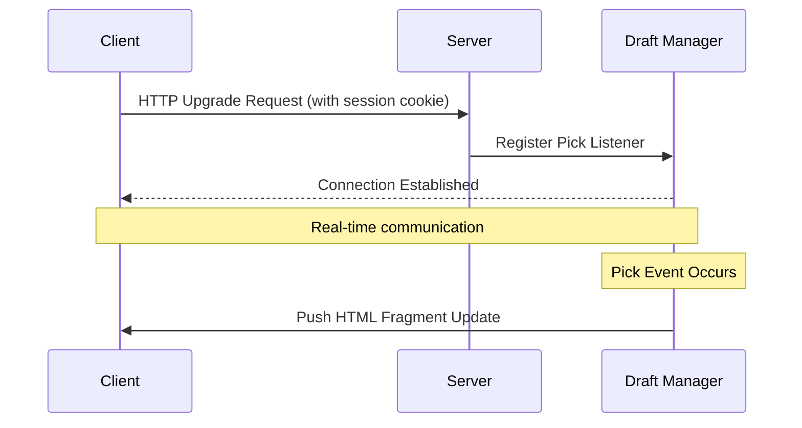
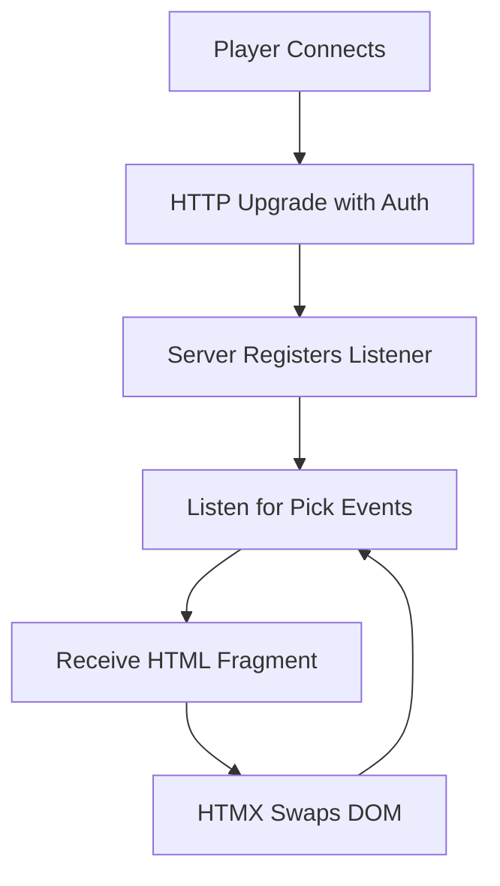

# WebSocket API

Real-time communication protocol for live draft updates and notifications.

## 🔌 WebSocket Connection

### Endpoint
```
ws://localhost:3000/u/draft/:id/pickNotifier
```

In production:
```
wss://your-domain.com/u/draft/:id/pickNotifier
```

### Authentication
WebSocket connections inherit authentication from the HTTP session that establishes them. A valid `sessionToken` cookie must be present when initiating the WebSocket upgrade request.

### Connection Flow

```mermaid
sequenceDiagram
    participant C as Client
    participant S as Server
    participant DM as Draft Manager
    
    C->>S: HTTP Upgrade Request (with session cookie)
    S->>DM: Register Pick Listener
    DM-->>C: Connection Established
    
    Note over C,DM: Real-time communication
    
    Note over DM: Pick Event Occurs
    DM->>C: Push HTML Fragment Update
```

## 🎯 Use Cases

### Draft Room Interface

```mermaid
graph TD
    A[Player Connects] --> B[HTTP Upgrade with Auth]
    B --> C[Server Registers Listener]
    C --> D[Listen for Pick Events]
    D --> E[Receive HTML Fragment]
    E --> F[HTMX Swaps DOM]
    F --> D
```

## 📡 Message Format

### Server to Client

The server sends **HTML fragments** (not JSON) via WebSocket text messages. These fragments are designed to work with HTMX's WebSocket extension for automatic DOM swapping.

**Message Type**: `websocket.TextMessage`

**Content**: Rendered Templ HTML component containing the updated draft pick interface.

Example message content:
```html
<div id="draftPicks" class="flex flex-col w-full h-full gap-6 p-6">
  <!-- Updated pick list HTML -->
</div>
```

### Client to Server

The client does not need to send messages. The connection is primarily server-push. The server uses the connection for:
- **Ping/Pong**: Server sends ping frames every 30 seconds to keep the connection alive
- **Read Loop**: Client messages are read but not processed (used only for connection health monitoring)

## 🔧 Technical Details

### Connection Parameters

| Parameter | Value | Description |
|-----------|-------|-------------|
| Read Buffer Size | 1024 bytes | WebSocket read buffer |
| Write Buffer Size | 1024 bytes | WebSocket write buffer |
| Read Timeout | 120 seconds | Maximum time between client messages |
| Ping Interval | 30 seconds | Server ping frequency |
| Write Timeout | 10 seconds | Maximum time to write a message |
| Message Queue | 10 events | Buffered channel for pick events |
| Send Timeout | 5 seconds | Maximum time to queue an event |

### Pick Event Structure

Events are triggered by the pick manager when picks are made:

```go
type PickEvent struct {
    Success bool        // Whether the pick was successful
    Err     error       // Error if pick failed
    Pick    model.Pick  // The pick that was made
    DraftId int         // ID of the draft
}
```

### Event Triggers

A WebSocket message is sent to all connected clients when:
- A player successfully makes a pick
- A pick is skipped (manually or automatically)
- The draft state changes during picking

### HTMX Integration

The frontend uses HTMX's WebSocket extension (`hx-ext="ws"`) to handle connections:

```html
<div hx-ext="ws" ws-connect="/u/draft/123/pickNotifier">
  <!-- Content automatically updates when messages arrive -->
</div>
```

HTMX automatically swaps the DOM when WebSocket messages are received.

## 🛡️ Error Handling

### Connection Errors

| Error Type | Behavior |
|------------|----------|
| Unexpected Close | Logged as warning, listener removed |
| Write Timeout | Connection closed, listener removed |
| Send Timeout | Event dropped, connection remains |
| Draft Not Found | Warning logged, message skipped |

### Client Disconnection

When a client disconnects:
1. Read loop detects closure
2. `done` channel signals cleanup
3. Pick listener is removed from draft manager
4. WebSocket connection is closed
5. Client goroutine waits for read loop to finish

## 📊 Metrics

The system tracks active WebSocket listeners via Prometheus metrics:

- `websocket_listeners_active`: Gauge of current active WebSocket connections

## ⚠️ Limitations

- No JSON API: Messages are HTML fragments only
- No client-initiated actions: All commands go through HTTP endpoints
- No broadcast to specific users: All draft participants receive the same updates
- No reconnection logic: Client must reconnect manually if connection drops

## 🔗 Related Documentation

- [Web Endpoints](./web-endpoints.md) - HTTP endpoints for pick submission
- [Draft States](../business-logic/draft-states.md) - Draft lifecycle and state machine
- [Pick Validation](../business-logic/pick-validation.md) - Rules for valid picks
