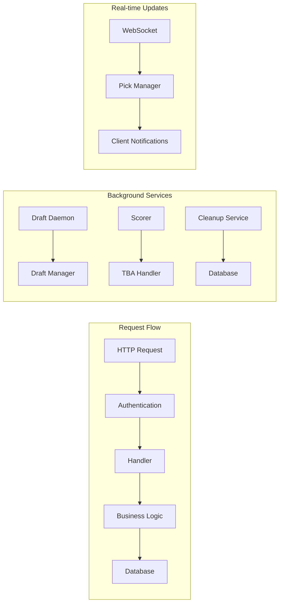
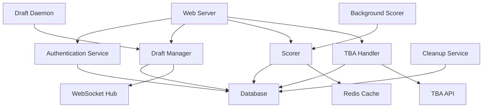
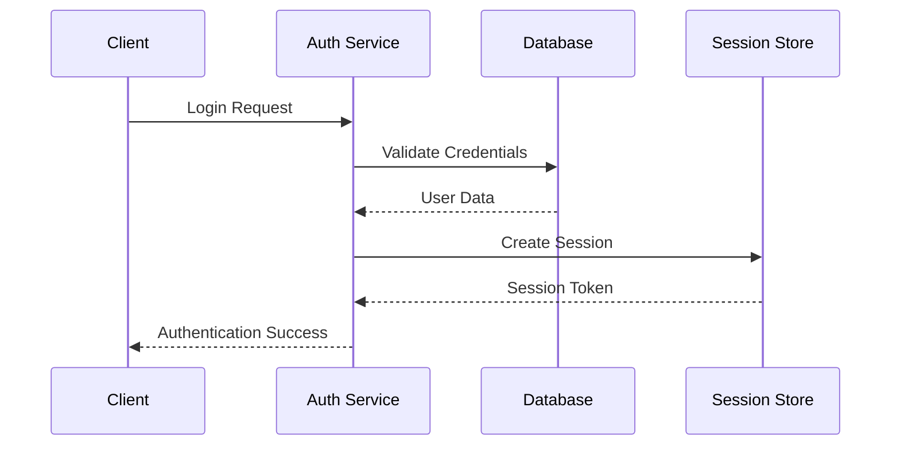

# Component Interactions

How the various subsystems of the Fantasy FRC application communicate and interact.

## 🔄 Interaction Patterns

## 📡 Communication Protocols

### HTTP/HTTPS
- **Purpose**: Client-server communication
- **Format**: REST API with JSON payloads
- **Authentication**: Session-based middleware

### WebSocket
- **Purpose**: Real-time draft updates
- **Events**: Pick notifications, score updates, draft state changes
- **Protocol**: Custom message format

### Database Connections
- **Primary**: PostgreSQL connection pool
- **Transactions**: ACID compliance for data integrity
- **Prepared Statements**: Security and performance

## 🔗 Service Dependencies

## 🎯 Key Interactions

### Draft Creation Flow
1. Client sends draft creation request
2. Authentication validates user session
3. Draft Manager validates draft parameters
4. Database saves draft configuration

### Pick Processing Flow
1. Client submits team pick
2. Pick Manager validates selection
3. Database records pick with timestamp
4. WebSocket broadcasts pick to all players

### Score Update Flow
1. TBA Handler receives match results
2. Scorer processes match data
3. Database updates team and player scores

## 🔐 Security Interactions

### Authentication Flow

### Authorization Checks
- **Route Protection**: Middleware-based access control
- **Role Validation**: Admin vs user permissions
- **Resource Ownership**: Draft ownership verification

## ⚡ Performance Considerations

### Database Optimization
- **Connection Pooling**: Efficient connection management
- **Index Strategy**: Optimized query performance
- **Transaction Boundaries**: Minimal lock duration

### Caching Strategy
- **Session Cache**: Redis for fast session lookup
- **Score Cache**: Frequently accessed score data
- **Static Assets**: CDN for improved load times

### Real-time Efficiency
- **WebSocket Groups**: Selective client notifications
- **Message Batching**: Reduced network overhead
- **Connection Management**: Resource cleanup

---

*TODO: Add detailed interaction diagrams, error handling flows, and performance metrics*
