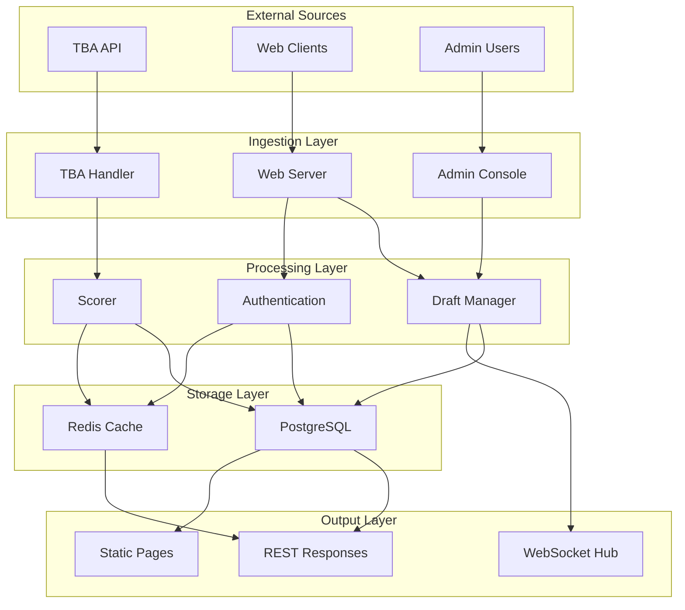
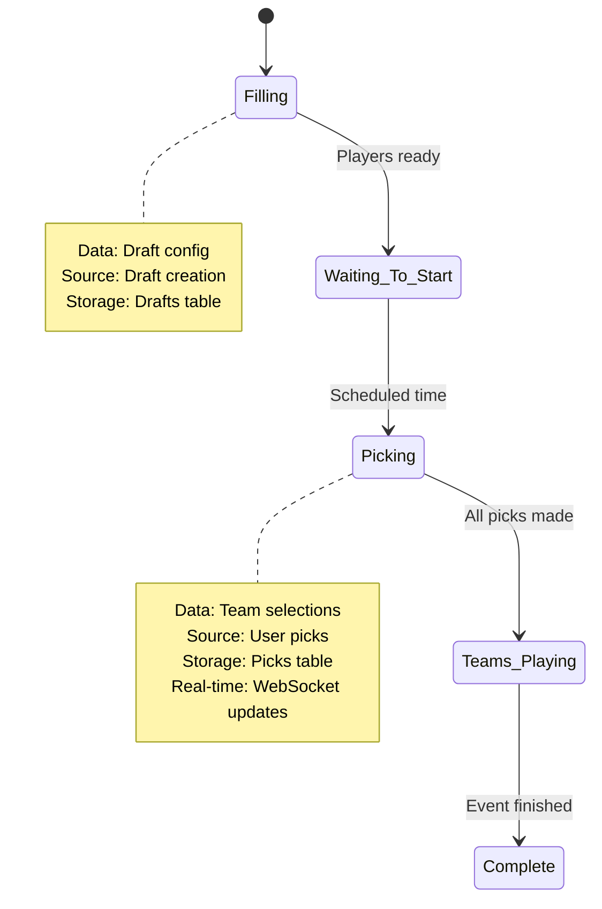
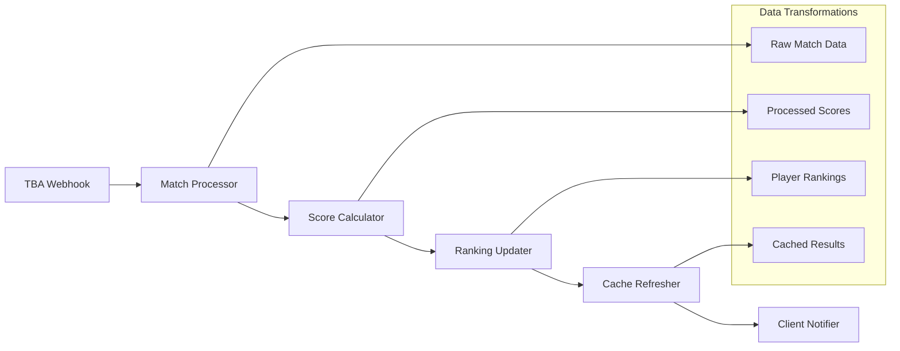
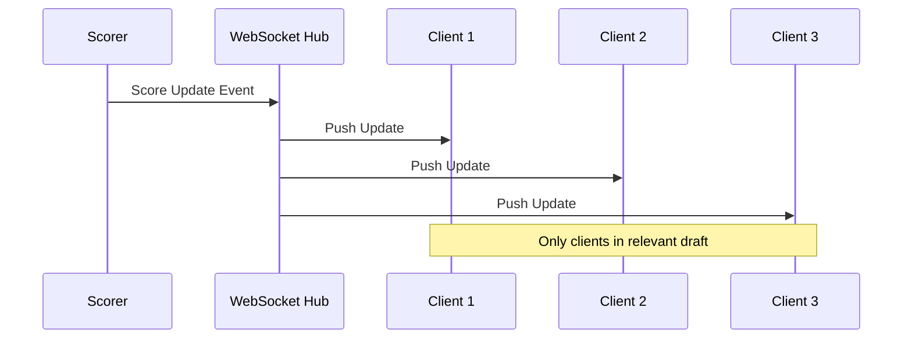
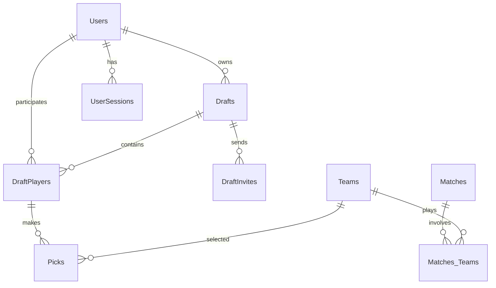

# Data Flow

How data moves through the Fantasy FRC system from external sources to end users.

## 🌊 Data Flow Overview

## 📊 Data Types and Sources

### FRC Competition Data
- **Source**: The Blue Alliance API
- **Types**: Teams, matches, events, rankings
- **Frequency**: Real-time webhook + periodic polling
- **Format**: JSON API responses

### User-Generated Data
- **Source**: Web client interactions
- **Types**: Drafts, picks, user accounts, invitations
- **Frequency**: User-driven events
- **Validation**: Server-side validation and sanitization

### Administrative Data
- **Source**: Admin console actions
- **Types**: System configuration, user management
- **Frequency**: Administrative operations
- **Authorization**: Role-based access control

## 🔄 Core Data Flows

### Draft Lifecycle Data Flow

### Scoring Data Pipeline

### Real-time Notification Flow

## 🗄️ Data Storage Patterns

### Primary Database (PostgreSQL)

### Cache Layer (Redis)
- **Session Storage**: Fast user authentication
- **Score Cache**: Frequently accessed rankings
- **Draft State**: Current draft status for quick lookups
- **TTL Strategy**: Automatic cache expiration

## 📈 Data Volume and Performance

### Data Characteristics
| Data Type | Volume | Update Frequency | Access Pattern |
|-----------|--------|------------------|----------------|
| User Data | Low | Medium | Read-heavy |
| Draft Data | Medium | High (during drafts) | Read-write |
| Match Data | High | Very High (events) | Write-heavy |
| Score Data | Medium | High | Read-heavy |

### Performance Optimizations
- **Database Indexing**: Optimized query performance
- **Connection Pooling**: Efficient resource usage
- **Batch Processing**: Reduced database round trips
- **Async Processing**: Non-blocking operations

## 🔒 Data Security and Privacy

### Data Protection
- **Encryption**: Password hashing with bcrypt
- **Session Security**: SHA256 token generation
- **Input Validation**: SQL injection prevention
- **Data Sanitization**: XSS protection

### Privacy Considerations
- **User Data**: Minimal personal information collection
- **Session Data**: Automatic expiration and cleanup
- **Audit Trail**: Administrative action logging
- **Data Retention**: Configurable cleanup policies

---

*TODO: Add detailed data transformation examples, performance benchmarks, and security audit procedures*