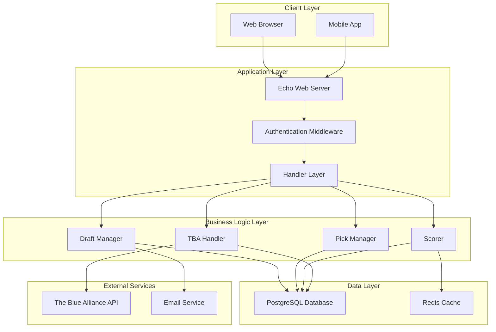
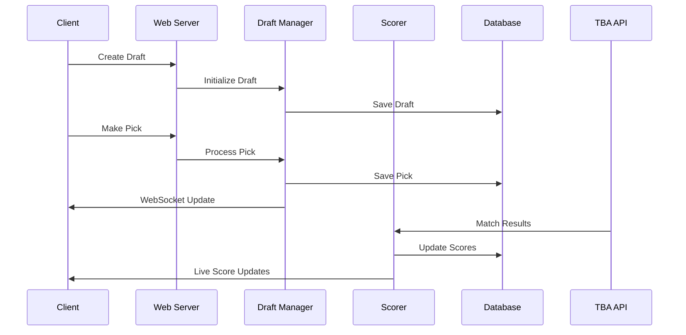

# System Overview

High-level architecture of the Fantasy FRC web application.

## 🏗️ Architecture Components

## 📋 Core Components

### Web Server
- **Framework**: Echo v4
- **Purpose**: HTTP request handling and routing
- **Features**: Static assets, middleware, WebSocket support

### Authentication System
- **Method**: Session-based authentication
- **Security**: bcrypt password hashing, SHA256 session tokens
- **Features**: Role-based access control, admin permissions

### Draft Management
- **State Machine**: Draft lifecycle management
- **Real-time**: WebSocket notifications for draft events
- **Validation**: Pick validation and timing enforcement

### Scoring System
- **Background Service**: Continuous match result processing
- **Algorithm**: Complex scoring based on match types and alliance selection
- **Real-time**: Live score updates and rankings

## 🔄 Data Flow Overview

## 🎯 Design Principles

- **Modularity**: Clear separation of concerns
- **Scalability**: Horizontal scaling support
- **Reliability**: Error handling and recovery
- **Security**: Authentication and data protection
- **Performance**: Efficient data access and caching

## 📊 Technology Stack

| Component | Technology | Purpose |
|-----------|------------|---------|
| Web Framework | Echo v4 | HTTP server and routing |
| Database | PostgreSQL | Primary data storage |
| Caching | Redis | Session storage and caching |
| Frontend | Templ + HTMX | Server-rendered UI |
| Real-time | WebSocket | Live updates |
| External API | The Blue Alliance | FRC data source |

---

*TODO: Add detailed component descriptions, deployment diagrams, and scaling considerations*