# Draft State Machine Visual Guide

Visual representations of Fantasy FRC draft lifecycle and state management.

## 🎯 Complete State Flow

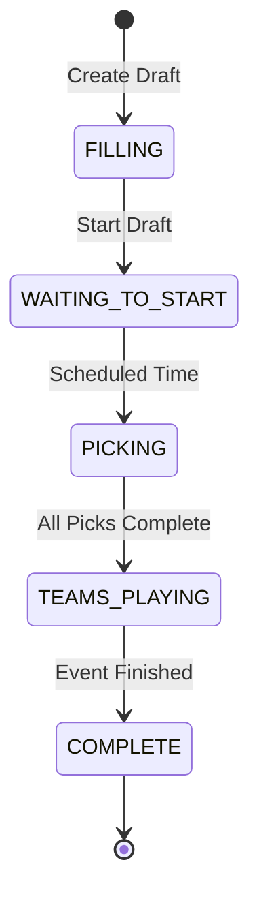

## 📊 State Transition Matrix

| Current State | Next State | Trigger | Auto? |
|---------------|-------------|----------|---------|
| FILLING | WAITING_TO_START | Owner starts draft | ❌ |
| WAITING_TO_START | PICKING | Scheduled time reached | ✅ |
| PICKING | TEAMS_PLAYING | 64 picks completed | ✅ |
| TEAMS_PLAYING | COMPLETE | All events finished | ✅ |

## 🎮 Draft Lifecycle Timeline

```mermaid
gantt
    title Typical Draft Timeline
    dateFormat X
    axisFormat %s
    
    section Draft States
    Setup Phase :active, filling, 0, 3
    Waiting Period :active, waiting, 3, 5
    Picking Phase :active, picking, 5, 9
    Competition :active, playing, 9, 13
    Completed :done, complete, 13, 14
```

## 🔄 Pick Management Flow

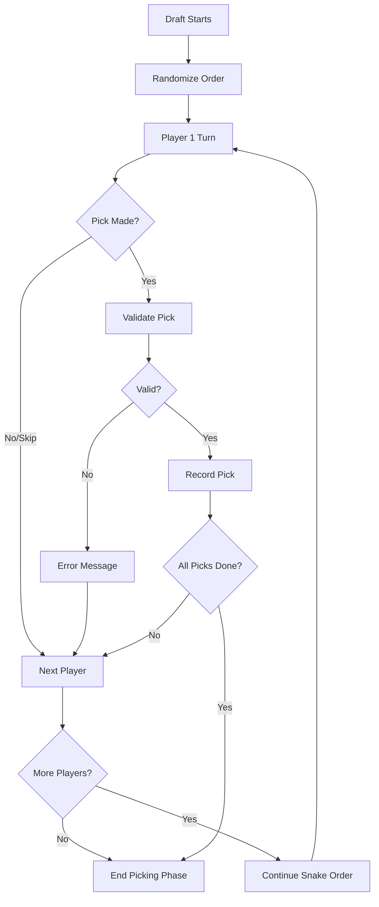

## 🐍 Snake Draft Pattern

```mermaid
graph TD
    subgraph "Round 1 (Forward)"
        A1[Player 1] --> A2[Player 2]
        A2 --> A3[Player 3]
        A3 --> A4[Player 4]
        A4 --> A5[Player 5]
        A5 --> A6[Player 6]
        A6 --> A7[Player 7]
        A7 --> A8[Player 8]
    end
    
    subgraph "Round 2 (Reverse)"
        B1[Player 8] --> B2[Player 7]
        B2 --> B3[Player 6]
        B3 --> B4[Player 5]
        B4 --> B5[Player 4]
        B5 --> B6[Player 3]
        B6 --> B7[Player 2]
        B7 --> B8[Player 1]
    end
    
    subgraph "Round 3 (Forward)"
        C1[Player 1] --> C2[Player 2]
        C2 --> C3[Player 3]
        C3 --> C4[Player 4]
        C4 --> C5[Player 5]
        C5 --> C6[Player 6]
        C6 --> C7[Player 7]
        C7 --> C8[Player 8]
    end
    
    A8 --> B1
    B8 --> C1
```

## ⏰ Time Management System

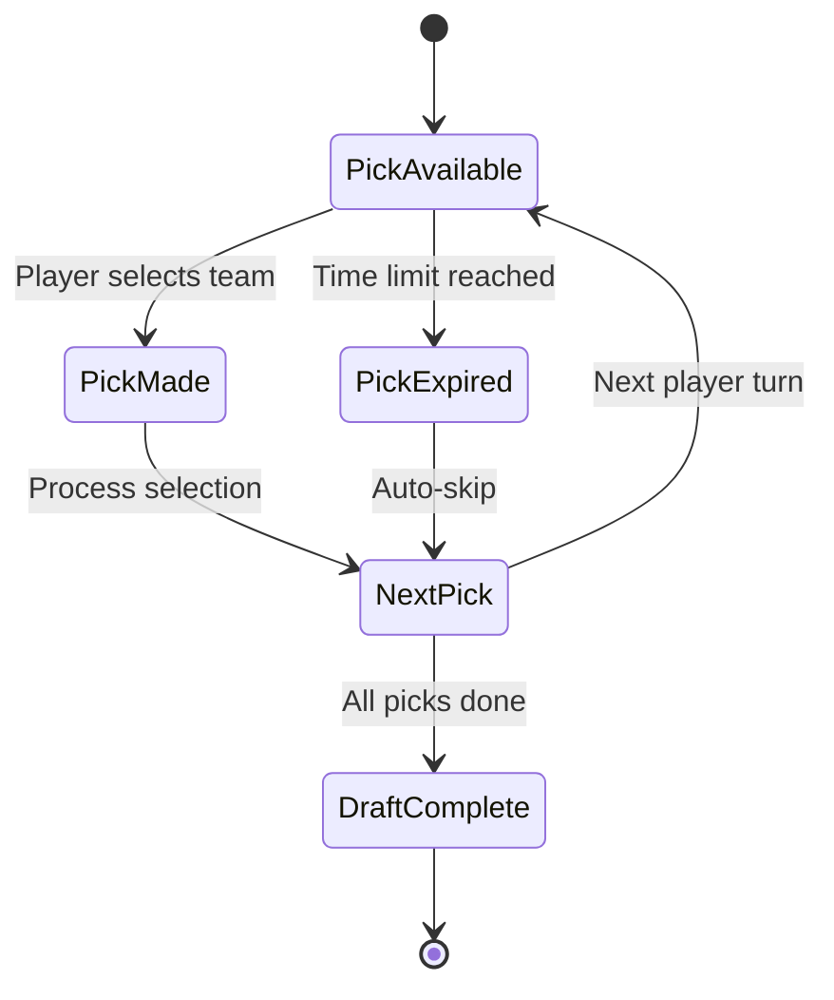

### Business Hours Schedule

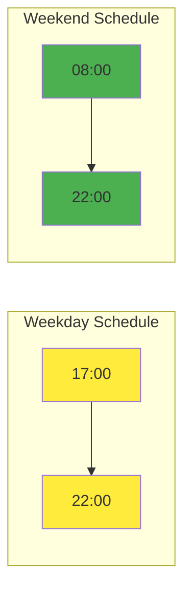

## 🔒 Concurrency and Locking

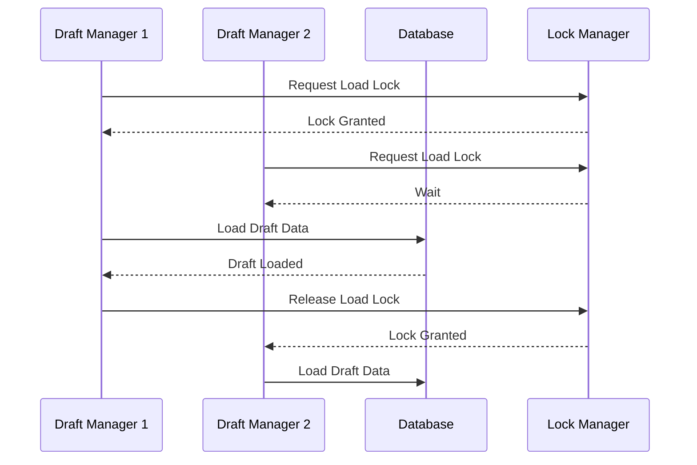

## 📡 Real-time Notification Flow

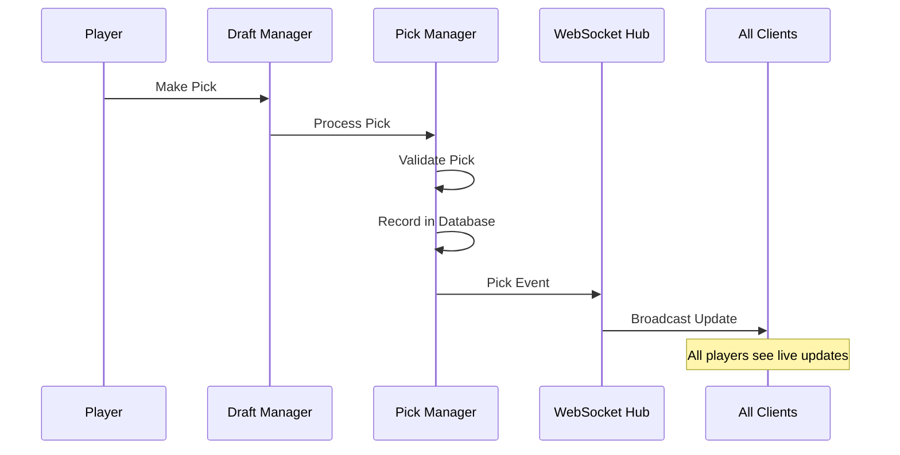

## 🎯 State-Specific Operations

### FILLING State Operations
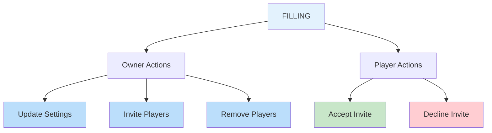

### PICKING State Operations
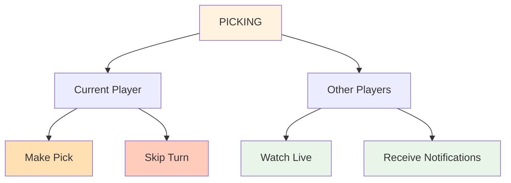

## 📈 Performance Metrics

### Draft Completion Rates
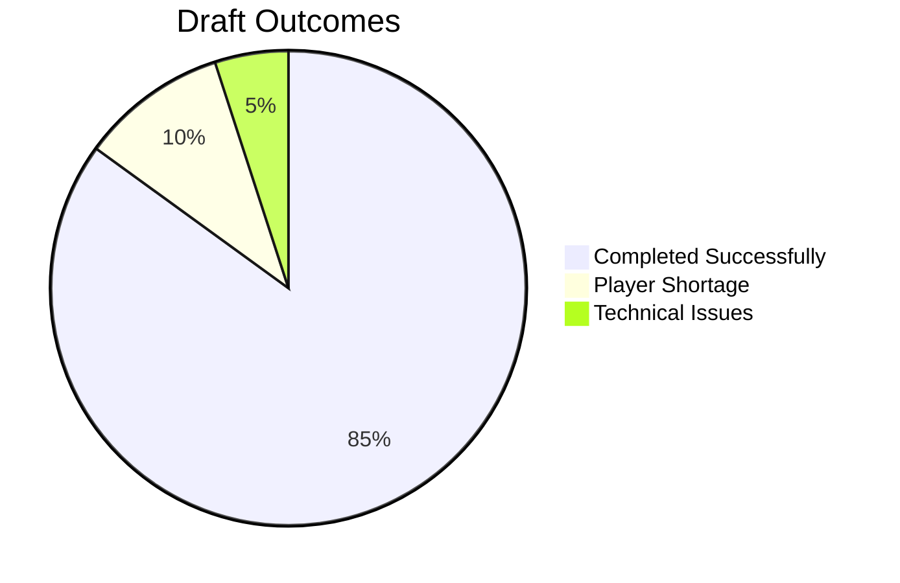

### Pick Speed Analysis
```mermaid
bar-chart
    title Average Pick Time by Round
    x-axis [Round 1, Round 2, Round 3, Round 4]
    y-axis "Minutes" 0 --> 60
    series [Average Time]
    data [45, 52, 48, 55]
```

## 🚨 Error Handling Scenarios

### Invalid State Transitions
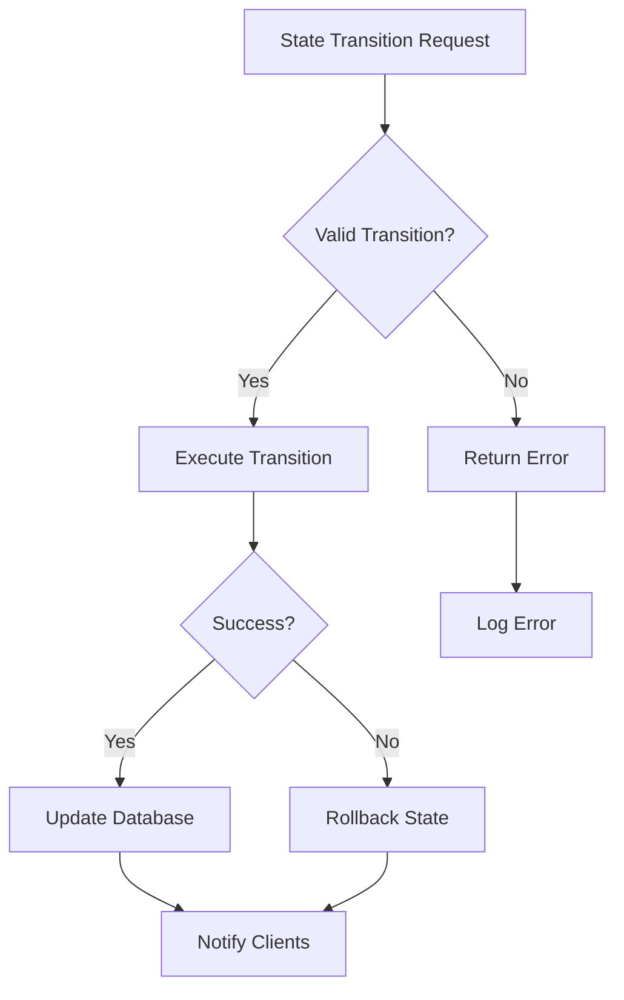

### Pick Validation Failures
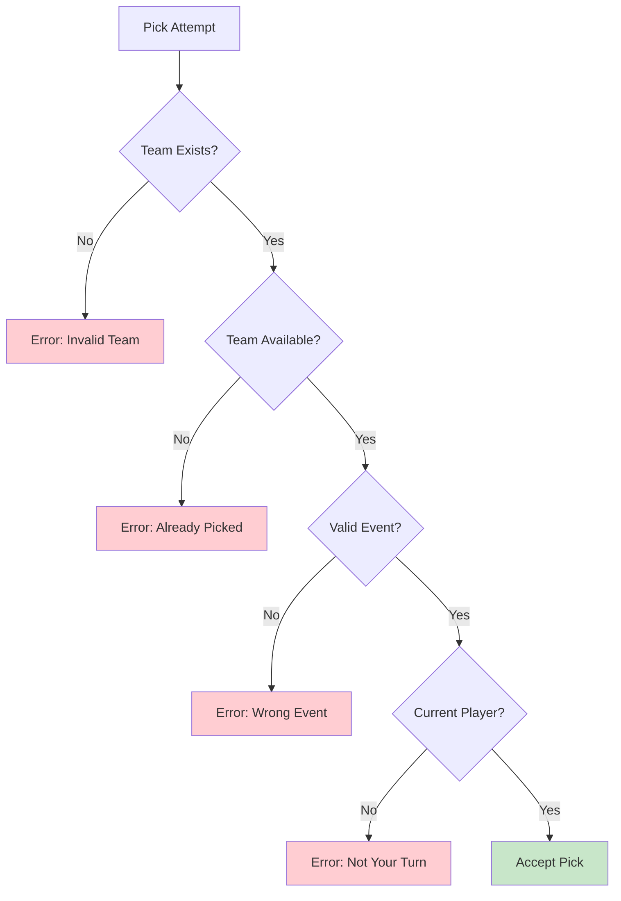

## 🎮 User Experience Flow

### Complete Draft Journey
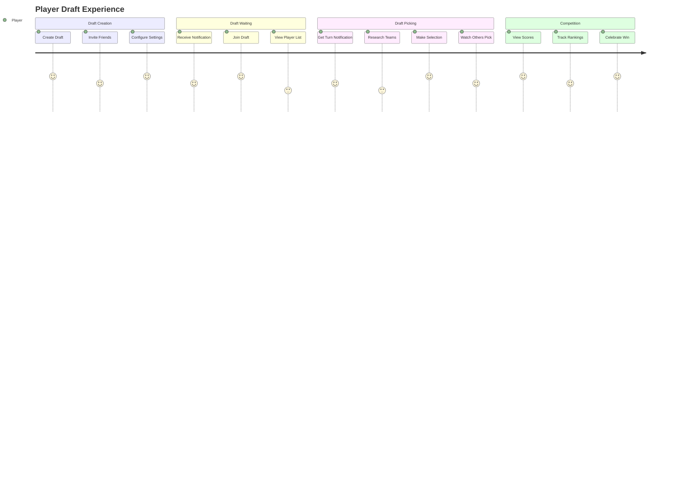

---

*Visual guide complements detailed state machine documentation at [draft-states.md](./draft-states.md)*