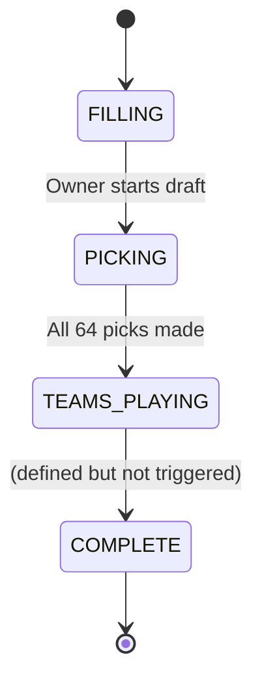
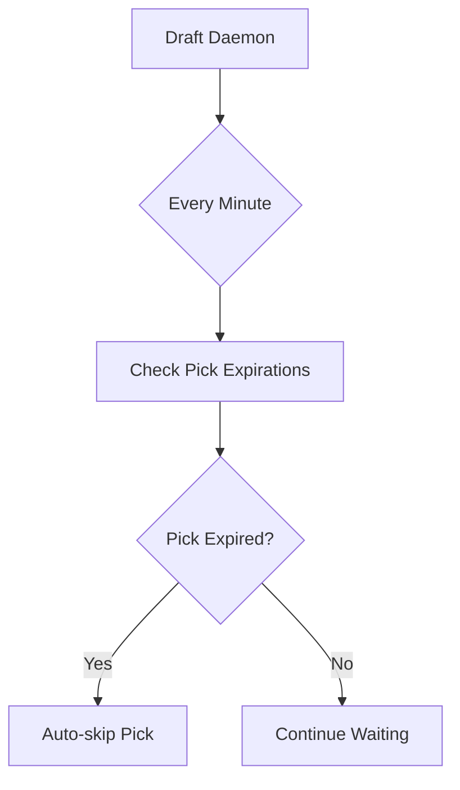
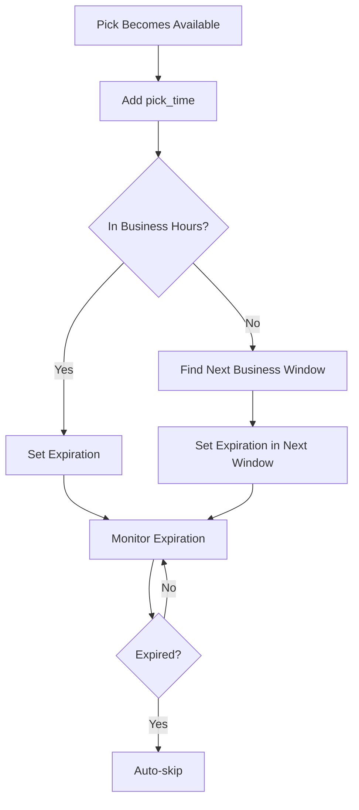
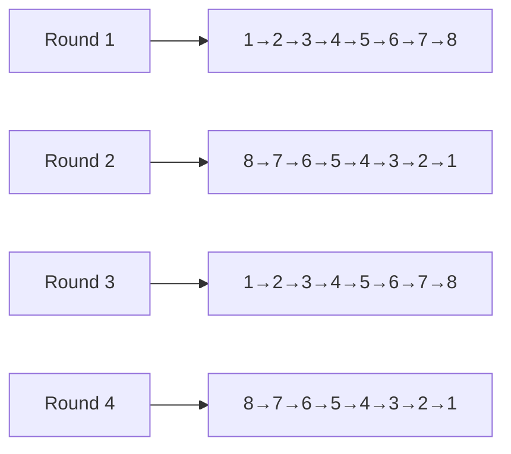
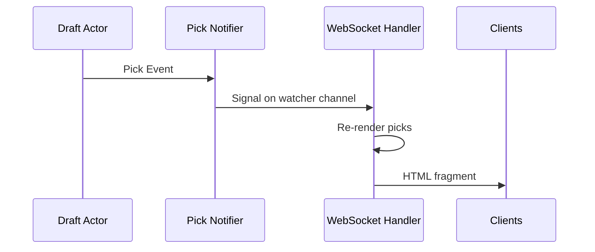

# Draft State Machine

> **AI-Generated Documentation**
> This documentation was generated with AI assistance and may contain errors or outdated information. For official guidance, verify with the development team or consult source code.

Complete documentation of the Fantasy FRC draft lifecycle and state management system.

## 🎯 Overview

The Fantasy FRC draft system uses a finite state machine with five defined states. In the current implementation, drafts move directly from `FILLING` to `PICKING` when the owner starts the draft. `WAITING_TO_START` is defined as a state value but is not wired into the state machine, and `TEAMS_PLAYING` → `COMPLETE` is defined but not automatically triggered.


```mermaid
stateDiagram-v2
    [*] --> FILLING
    FILLING --> PICKING: Owner starts draft
    PICKING --> TEAMS_PLAYING: All 64 picks made
    TEAMS_PLAYING --> COMPLETE: (defined but not triggered)
    COMPLETE --> [*]
```

## 📋 Draft States

### 1. FILLING (`"Filling"`)
**Purpose**: Initial draft setup and player recruitment.

**Description**:
- Draft is created but not yet ready to start
- Owner can modify draft settings
- Players can be invited and accept invitations
- No picks can be made

**Valid Operations**:
- ✅ Update draft settings (name, description, webhook)
- ✅ Invite players
- ✅ Accept/decline invitations
- ✅ Remove pending invitations (by owner)
- ❌ Make picks
- ❌ Start draft (unless exactly 8 accepted players)

**Transition To**: `PICKING`

### 2. WAITING_TO_START (`"Waiting to Start"`)
**Purpose**: Reserved state. The value exists in code but is **not used** by the state machine.

**Description**:
- `WAITING_TO_START` is not registered in the actor's state map.
- Drafts currently transition directly from `FILLING` to `PICKING`.
- A draft that somehow lands in this state cannot make actor-driven transitions.

### 3. PICKING (`"Picking"`)
**Purpose**: Active draft phase where players select teams.

**Description**:
- Players take turns selecting FRC teams
- Snake draft order ensures fairness
- Time limits enforce pick pace
- Real-time updates via WebSocket

**Valid Operations**:
- ✅ Make team picks (current player only)
- ✅ Skip current pick (manual or automatic)
- ✅ View draft progress
- ✅ Receive real-time notifications
- ❌ Modify draft settings (in practice, the actor does not enforce this)
- ❌ Add/remove players

**Transition To**: `TEAMS_PLAYING` (when all 64 picks completed)

### 4. TEAMS_PLAYING (`"Teams Playing"`)
**Purpose**: Competition phase where drafted teams compete.

**Description**:
- All picks are finalized
- Teams compete in FRC events
- Scores are calculated and updated

**Valid Operations**:
- ✅ View draft results and scores
- ✅ Track team performance
- ✅ Monitor rankings
- ❌ Make picks

**Transition To**: `COMPLETE` (defined in the state machine but no code triggers it)

### 5. COMPLETE (`"Complete"`)
**Purpose**: Draft is finished and final rankings are set.

**Description**:
- All competition events are completed
- Final scores are calculated
- Winners are determined
- Draft becomes read-only

**Valid Operations**:
- ✅ View final results
- ❌ Any modifications

**Transition To**: None (terminal state)

## 🔄 State Transitions

### Transition Implementation

State transitions are handled by the draft actor. Each registered transition has a corresponding `stateTransition` implementation.

### Transition Details

#### FILLING → PICKING
**Trigger**: Draft owner starts the draft (via UI or `startdraft` admin command).

**Actions**:
- Validate exactly 8 accepted players
- Cancel outstanding pending invitations
- Randomize player pick order
- Create the first `Picks` row with `AvailableTime` and `ExpirationTime`
- Update draft status to `PICKING`
- Add draft to the draft daemon

**Code**: `ToPickingTransition.executeTransition()`

#### PICKING → TEAMS_PLAYING
**Trigger**: All 64 picks completed (8 players × 8 teams).

**Actions**:
- Update draft status to `TEAMS_PLAYING`

**Code**: `ToPlayingTransition.executeTransition()`

#### TEAMS_PLAYING → COMPLETE
**Trigger**: Defined but not currently triggered by any code path.

**Actions**:
- Update draft status to `COMPLETE`

**Code**: `ToCompleteTransition.executeTransition()`

## ⏰ Timing and Automation

### Draft Daemon

The draft daemon is a background service that checks for expired/skipped picks:


```mermaid
graph TD
    A[Draft Daemon] --> B{Every Minute}
    B --> C[Check Pick Expirations]
    C --> D{Pick Expired?}
    D -->|Yes| E[Auto-skip Pick]
    D -->|No| F[Continue Waiting]
```

The daemon does **not** automatically transition `WAITING_TO_START` drafts to `PICKING`.

### Pick Time Management

**Business Hours** (configurable via `PICK_WINDOWS_CONFIG_FILE`):
- **Weekend**: 8:00 - 22:00
- **Weekdays**: 17:00 - 22:00

**Pick Duration**: 1 hour by default, configurable via `pick_time` in `PICK_WINDOWS_CONFIG_FILE`.

**Expiration Logic**:

```mermaid
flowchart TD
    A[Pick Becomes Available] --> B[Add pick_time]
    B --> C{In Business Hours?}
    C -->|Yes| D[Set Expiration]
    C -->|No| E[Find Next Business Window]
    E --> F[Set Expiration in Next Window]
    D --> G[Monitor Expiration]
    F --> G
    G --> H{Expired?}
    H -->|Yes| I[Auto-skip]
    H -->|No| G
```

## 🎮 Pick Management

### Snake Draft Order
Ensures fair team distribution:


```mermaid
graph LR
    A[Round 1] --> B[1→2→3→4→5→6→7→8]
    C[Round 2] --> D[8→7→6→5→4→3→2→1]
    E[Round 3] --> F[1→2→3→4→5→6→7→8]
    G[Round 4] --> H[8→7→6→5→4→3→2→1]
```

### Pick Validation
Before accepting a pick, the handler and validator check:

1. **Not Picked**: Team not already selected in this draft
2. **Valid Event**: Team participates in configured championship events
3. **Current Player**: Only current player can pick
4. **Time Valid**: Pick made before expiration
5. **Draft State**: Draft is in `PICKING`

See [Pick Validation](./pick-validation.md) for details.

### Skip Mechanisms
**Manual Skip**: Player toggles auto-skip for their turns.
**Auto Skip**: System skips when `ExpirationTime` is reached.

## 🔒 Concurrency and Locking

### Draft Actor Model

Each active draft has a single goroutine (the draft actor) that processes messages sequentially. This serializes state changes and pick operations for a given draft.

```go
type DraftActor struct {
    inbox chan Message
    draftState model.DraftModel
    states map[model.DraftState]*state
    mu sync.RWMutex
}
```

## 📡 Real-time Notifications

### WebSocket Updates

The pick notifier sends a signal to all watchers when a pick event occurs. The WebSocket handler then re-renders the pick interface and pushes an HTML fragment to each connected client.


```mermaid
sequenceDiagram
    participant D as Draft Actor
    participant P as Pick Notifier
    participant W as WebSocket Handler
    participant C as Clients

    D->>P: Pick Event
    P->>W: Signal on watcher channel
    W->>W: Re-render picks
    W->>C: HTML fragment
```

The implementation sends an untyped `bool` signal; there are no typed event names.

## 🛠️ Implementation Details

### State Machine Structure
```go
type state struct {
    state       model.DraftState
    transitions map[model.DraftState]stateTransition
}
```

### Error Handling
Invalid transitions return:

```go
type invalidStateTransitionError struct {
    currentState   model.DraftState
    requestedState model.DraftState
}
```

### Database Operations
Each transition updates the draft status:

```sql
UPDATE Drafts
SET Status = $1
WHERE Id = $2;
```

## 🎯 Edge Cases and Error Handling

### Invalid Transitions
System prevents illegal state changes:
- Cannot start draft without exactly 8 accepted players
- Cannot make picks outside `PICKING` state

### Recovery Mechanisms
- **Daemon Restart**: Reloads active `PICKING` drafts from database
- **Crash Recovery**: State preserved in database

### Administrative Overrides
Admin commands can force state transitions:
- `startdraft -id <draftId>` forces `FILLING` → `PICKING`
- No command currently forces `TEAMS_PLAYING` → `COMPLETE`

---

*Last updated: 2026-09-04*

*TODO: Add detailed timing configuration examples and decide whether to implement or remove `WAITING_TO_START`.*
