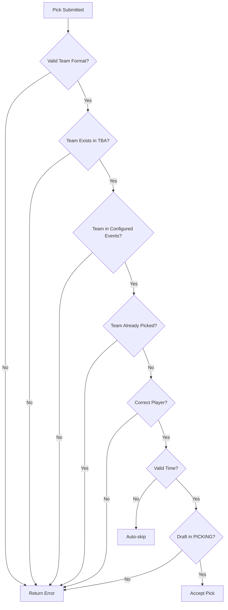

# Pick Validation

Complete documentation of pick validation rules and eligibility requirements for Fantasy FRC drafts.

> **AI-Generated Documentation**
> This documentation was generated with AI assistance and may contain errors or outdated information. For official guidance, verify with the development team or consult source code.

## Overview

Pick validation ensures that all team selections during a draft are valid, legal, and comply with Fantasy FRC rules. The validation system checks multiple criteria before accepting any pick.

## Validation Criteria

### 1. Team Existence Validation

**Rule**: The selected team must exist in The Blue Alliance (TBA) database.

**Validation Process**:
- Team ID format: `frc{number}` (e.g., `frc254`)
- Verify team exists via TBA API lookup
- Reject unknown team IDs

**Error Handling**:
```
Invalid team: Team frc99999 does not exist in The Blue Alliance database
```

### 2. Event Participation Validation

**Rule**: The team must be participating in the configured championship events.

**Validation Process**:
- Check team event registration against configured events
- Valid events: Archimedes, Curie, Daly, Galileo, Hopper, Johnson, Milstein, Newton, Einstein
- Verify team is registered for at least one active event

**Error Handling**:
```
Team frc254 is not registered for any configured championship events
```

### 3. Duplicate Pick Prevention

**Rule**: A team can only be picked once per draft.

**Validation Process**:
- Check `Picks` table for existing selection of same team
- Query: `SELECT * FROM Picks WHERE draft_id = ? AND team_tbaId = ?`
- Reject if team already selected

**Error Handling**:
```
Team frc254 has already been selected in this draft
```

### 4. Player Turn Validation

**Rule**: Only the current player whose turn it is can make a pick.

**Validation Process**:
- Verify user's UUID matches current picker's UUID
- Check draft state is `PICKING`
- Validate player order matches expected sequence

**Error Handling**:
```
It is not your turn to pick. Please wait for your assigned pick time.
```

### 5. Time Validity Validation

**Rule**: Picks must be made before the pick expiration time.

**Validation Process**:
- Compare current time against `ExpirationTime` in `Picks` table
- Check business hours compliance
- Verify pick is in `Available` state (not skipped)

**Error Handling**:
```
Your pick time has expired. The pick has been auto-skipped.
```

### 6. Draft State Validation

**Rule**: Picks can only be made when draft is in `PICKING` state.

**Validation Process**:
- Check `Drafts.Status` field
- Valid states: `PICKING` only
- Reject picks during: `FILLING`, `WAITING_TO_START`, `TEAMS_PLAYING`, `COMPLETE`

**Error Handling**```
Picks cannot be made while the draft is in FILLING state
```

## Business Hours Compliance

### Default Business Hours

| Day | Start | End |
|-----|-------|-----|
| Weekdays (Mon-Fri) | 17:00 | 22:00 |
| Weekends (Sat-Sun) | 08:00 | 22:00 |

### Business Hours Validation

**Pick Availability**:
- Picks are only available during business hours
- `AvailableTime` adjusted to next business window if outside hours
- `ExpirationTime` calculated from adjusted `AvailableTime`

**Example**:
```
Player receives pick at 16:00 on Monday
AvailableTime adjusted to 17:00 (next business window)
ExpirationTime = 17:00 + interval
```

### Time Zone Considerations

- All times stored in UTC
- Business hours applied in server's configured time zone
- Display times converted to user's local time zone

## Skip Mechanisms

### Manual Skip

Players can manually skip their turn:

**Process**:
1. Player clicks "Skip Pick" button
2. System sets `Skipped = true` on current pick
3. Pick advances to next player
4. No team is selected

**Validation**:
- Only current player can skip
- Draft must be in `PICKING` state
- Pick must not already be skipped

### Auto-Skip

System automatically skips expired picks:

**Trigger**:
- `CurrentTime > ExpirationTime`
- Pick is in `Available` state
- Business hours window is closed

**Process**:
1. System detects expired pick
2. Sets `Skipped = true`
3. Advances to next player
4. Calculates next `AvailableTime` based on business hours

**Example**:
```
Pick expires at 22:00
Next business window: Next day 17:00
New AvailableTime: Tomorrow 17:00
```

## Input Format Requirements

### Team Number Format

**Accepted Formats**:
- Plain number: `254`
- FRC prefix: `frc254`

**Validation**:
- Must be valid integer (1-9999)
- Maximum 4 digits
- Cannot be empty

**Error Handling**:
```
Invalid team number: "abc" is not a valid team number
```

### Special Characters

**Disallowed**:
- SQL injection attempts: `'; DROP TABLE picks; --`
- Script tags: `<script>alert('xss')</script>`
- Path traversal: `../../../etc/passwd`

**Sanitization**:
- All input sanitized before validation
- Prepared statements prevent SQL injection
- HTML escaping prevents XSS

## Validation Flow



## Error Response Format

### Validation Error Response

```json
{
    "error": {
        "code": "PICK_VALIDATION_FAILED",
        "message": "Detailed error description",
        "field": "teamNumber",
        "value": "frc99999"
    }
}
```

### Error Codes

| Code | Description |
|------|-------------|
| `INVALID_FORMAT` | Team number format is invalid |
| `TEAM_NOT_FOUND` | Team does not exist in TBA |
| `TEAM_NOT_ELIGIBLE` | Team not in configured events |
| `TEAM_ALREADY_PICKED` | Team already selected |
| `NOT_CURRENT_PLAYER` | Not the player's turn |
| `PICK_EXPIRED` | Pick time has expired |
| `INVALID_DRAFT_STATE` | Draft not in PICKING state |

## Security Considerations

### SQL Injection Prevention

- All queries use prepared statements
- No string concatenation in SQL
- Parameterized queries for all database operations

### XSS Prevention

- All user input escaped in responses
- Team numbers sanitized before display
- HTML template auto-escaping

### Race Condition Prevention

- Database transactions for pick operations
- Row-level locking on draft picks
- Optimistic concurrency control

## Testing Validation Rules

### Unit Tests

```go
func TestTeamExistenceValidation(t *testing.T) {
    // Test valid team
    valid, _ := ValidateTeam("frc254")
    assert.True(t, valid)

    // Test invalid team
    valid, _ = ValidateTeam("frc99999")
    assert.False(t, valid)
}

func TestDuplicatePickValidation(t *testing.T) {
    // Setup: Team already picked
    db.Create(&Pick{TeamTbaId: "frc254", DraftId: 1})

    // Test duplicate pick
    valid, _ := ValidateTeamForDraft("frc254", 1)
    assert.False(t, valid)
}
```

### Integration Tests

- Test full pick workflow with database
- Verify business hours logic
- Test auto-skip timing accuracy
- Validate concurrent pick attempts

## Performance Considerations

### Caching Strategy

- TBA team lookups cached for 1 hour
- Draft state cached per request
- Reduced database queries with prepared statements

### Query Optimization

- Indexed columns: `draft_id`, `team_tbaId`, `player_id`
- Composite indexes for common query patterns
- Connection pooling for concurrent validation

## Administrative Overrides

### Force Pick

Admins can manually assign a pick:

**Command**:
```
skippick -id <draftId> -team <teamNumber> -player <playerId>
```

**Validation Override**:
- Bypass team eligibility checks
- Force selection even outside business hours
- Override duplicate pick prevention

### Manual State Correction

Admins can fix invalid states:

**Command**:
```
correctstate -id <draftId> -state <stateName>
```

**Use Cases**:
- Recover from daemon crashes
- Reset stuck picks
- Emergency draft completion

---

*Pick validation ensures fair and consistent draft operations across all Fantasy FRC leagues.*
