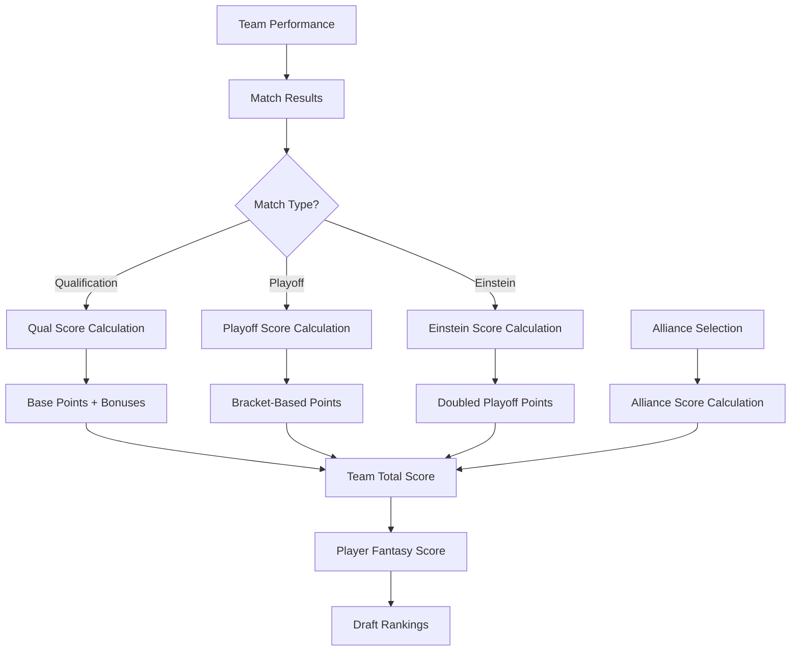
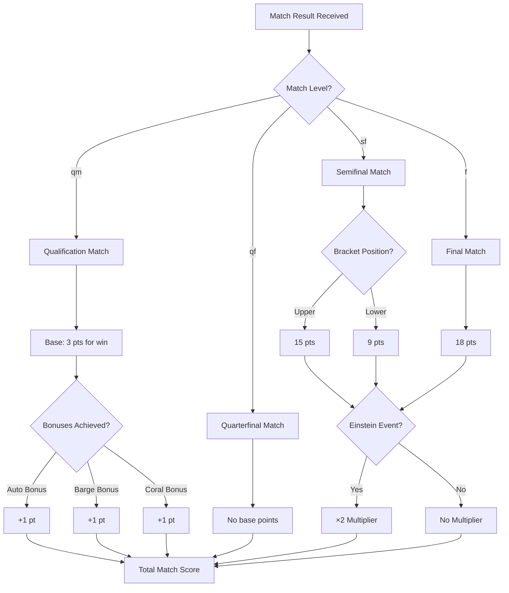
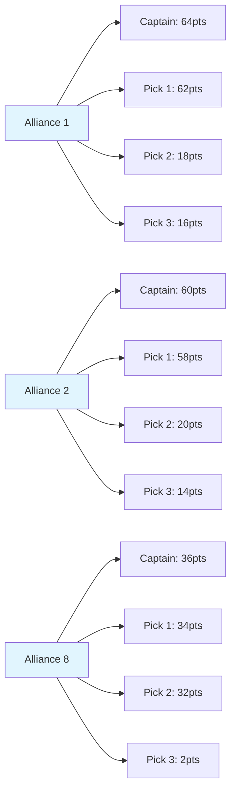
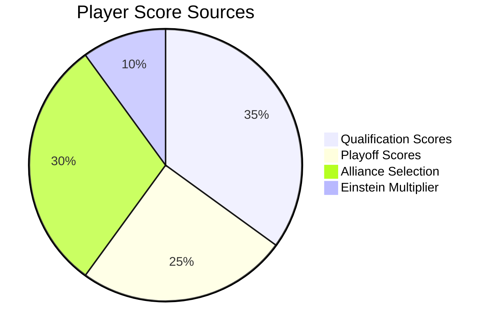
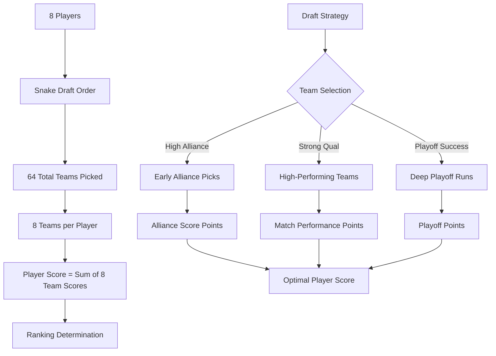
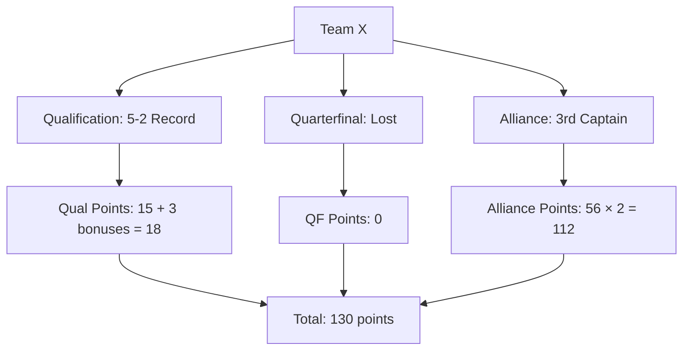
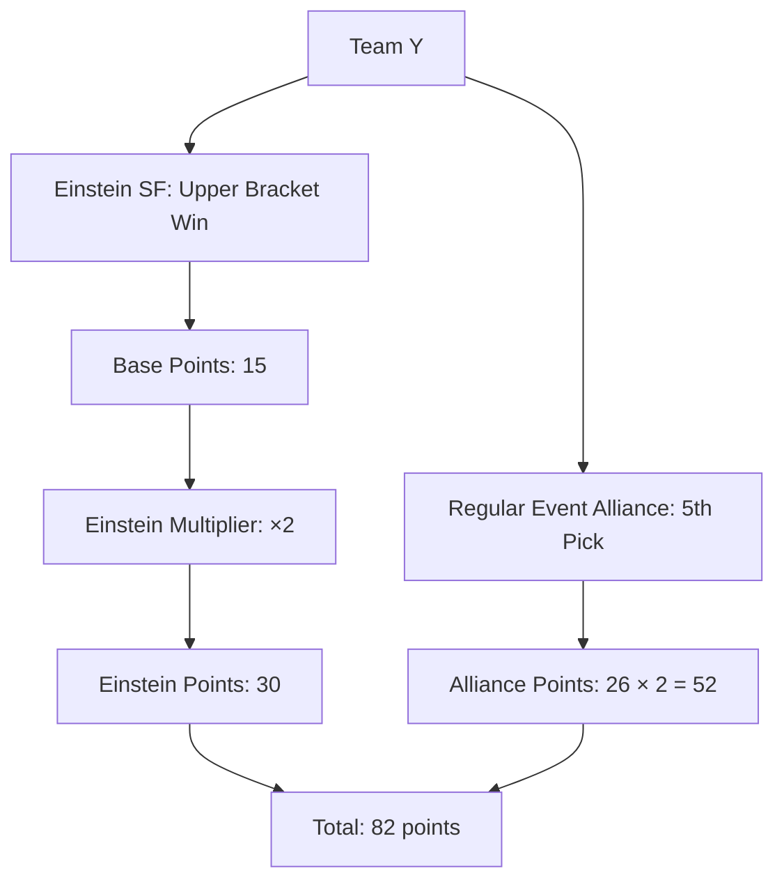
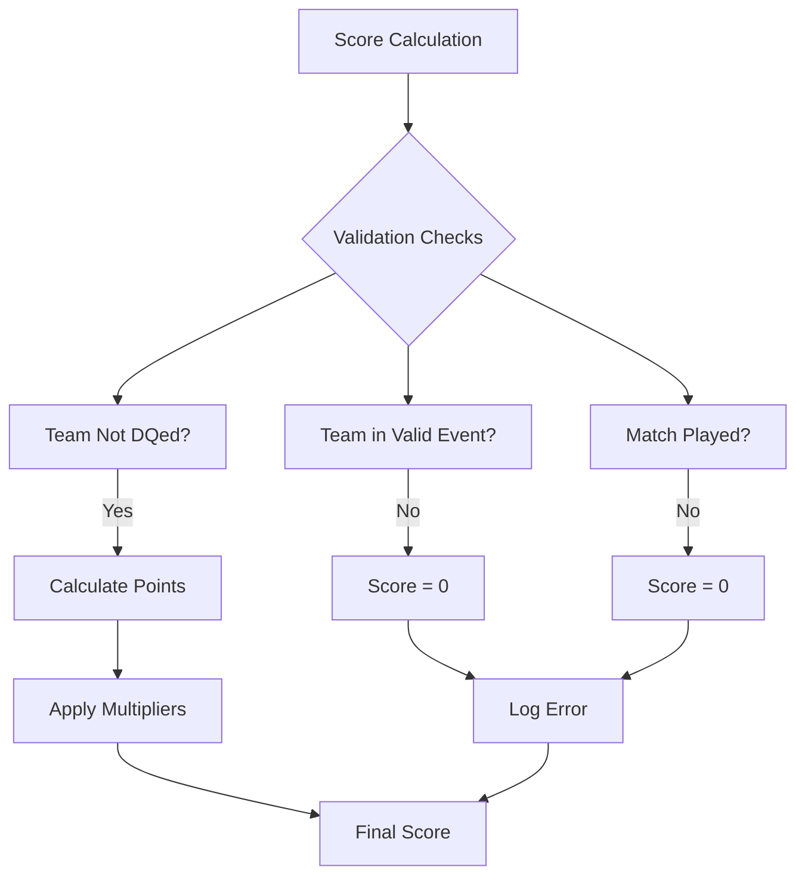

# Scoring Algorithm Visual Guide

Visual representations of the Fantasy FRC scoring system.

## 🎯 Complete Score Flow



## 📊 Match Scoring Decision Tree



## 🏆 Alliance Selection Scoring



## 📈 Player Score Composition



## 🎮 Draft Impact on Scoring



## ⏰ Match Processing Priority

```mermaid
gantt
    title Match Processing Order
    dateFormat X
    axisFormat %s
    
    section Event Types
    Qualification Matches :active, qm1, 0, 1
    Quarterfinals :active, qf1, 1, 2
    Semifinals :active, sf1, 2, 3
    Finals :active, f1, 3, 4
    Einstein Special :active, einstein, 4, 5
```



## 🎯 Score Calculation Examples

### Example 1: Championship Team Performance



### Example 2: Einstein Championship Team



## 📊 Score Distribution Analysis

```mermaid
bar-chart
    title Typical Score Distribution by Category
    x-axis [Qualification, Playoff QF, Playoff SF, Playoff F, Alliance]
    y-axis "Points" 0 --> 70
    series [Team A, Team B, Team C]
    data [15, 0, 15, 36, 108]
    data [12, 0, 0, 0, 64]
    data [18, 0, 30, 0, 52]
```

## 🔍 Validation Rules



---

*Visual guide complements the detailed scoring algorithm documentation at [scoring.md](./scoring.md)*