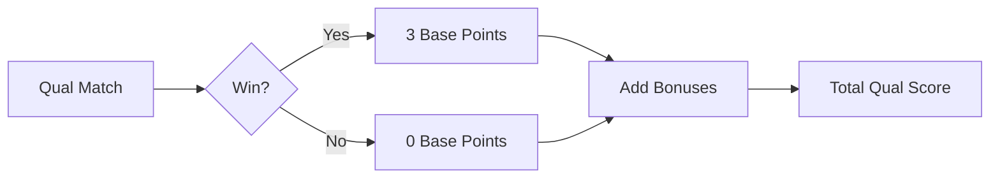
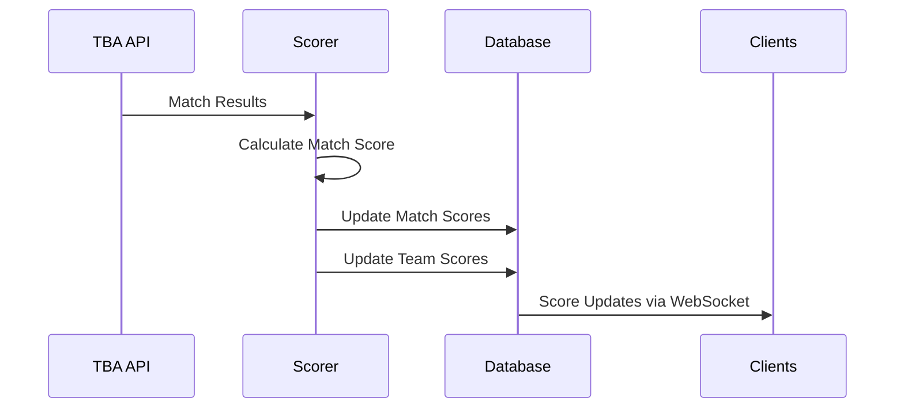

# Scoring Algorithm

Complete documentation of the Fantasy FRC scoring system that determines team and player rankings.

## 🎯 Overview

The Fantasy FRC scoring system calculates team scores based on actual FRC competition performance. Each team's total score is the sum of four components:

```
Total Score = Qualification Score + Playoff Score + Alliance Score + Einstein Score
```

## 📊 Score Components

### 1. Qualification Score (`Qual Score`)
Points earned in qualification matches.

**Base Points:**
- **Win**: 3 points to winning alliance
- **Loss/Tie**: 0 points

**2025 Game Bonuses** (per match):
- **Auto Bonus**: +1 point if achieved
- **Barge Bonus**: +1 point if achieved  
- **Coral Bonus**: +1 point if achieved

**Example:**


### 2. Playoff Score (`Playoff Score`)
Points earned in elimination matches (Quarterfinals, Semifinals, Finals).

**Point Values by Match Level:**
| Match Level | Base Points | Upper Bracket | Lower Bracket |
|-------------|--------------|---------------|---------------|
| Quarterfinal (qf) | - | - | - |
| Semifinal (sf) | - | 15 points | 9 points |
| Final (f) | 18 points | - | - |

**Bracket Determination:**
- **Upper Bracket**: Match sets 1, 2, 3, 4, 7, 8, 11
- **Lower Bracket**: Match sets 5, 6, 9, 10, 12, 13

**Einstein Multiplier:**
- All playoff scores at Einstein event (`2025cmptx`) are **doubled**

### 3. Alliance Score (`Alliance Score`)
Points based on alliance selection position at championship events.

**Alliance Selection Scoring Table:**
| Alliance | Captain | 1st Pick | 2nd Pick | 3rd Pick |
|----------|---------|-----------|-----------|-----------|
| 1st | 64 | 62 | 18 | 16 |
| 2nd | 60 | 58 | 20 | 14 |
| 3rd | 56 | 54 | 22 | 12 |
| 4th | 52 | 50 | 24 | 10 |
| 5th | 48 | 46 | 26 | 8 |
| 6th | 44 | 42 | 28 | 6 |
| 7th | 40 | 38 | 30 | 4 |
| 8th | 36 | 34 | 32 | 2 |

**Important Notes:**
- Scores are **doubled** from the table values (table shows base values)
- Only applies to championship events (not Einstein)
- Determined by actual alliance selection at events

### 4. Einstein Score (`Einstein Score`)
Special scoring for Einstein Championship matches.

**Calculation:**
- Uses same playoff scoring rules
- All points are **doubled**
- Only applies to matches at `2025cmptx` event

## 🔢 Score Calculation Examples

### Example 1: Qualification Match
Team wins qualification match with Auto and Coral bonuses:

```
Base Points: 3 (win)
Auto Bonus: +1
Coral Bonus: +1
Total: 5 points
```

### Example 2: Playoff Match
Team wins upper bracket semifinal at regular event:

```
Base Points: 15 (upper bracket SF)
Einstein Multiplier: x1 (not Einstein)
Total: 15 points
```

### Example 3: Einstein Playoff Match
Team wins lower bracket semifinal at Einstein:

```
Base Points: 9 (lower bracket SF)
Einstein Multiplier: x2
Total: 18 points
```

### Example 4: Alliance Selection
Team selected as 2nd pick by 3rd alliance:

```
Base Score: 54 (from table)
Multiplier: x2
Total: 108 points
```

## 📈 Score Processing Flow



### Match Processing Order
1. **Qualification Matches** (`*_qm*`)
2. **Quarterfinals** (`*_qf*`)
3. **Semifinals** (`*_sf*`)
4. **Finals** (`*_f*`)
5. **Einstein Matches** (`*cmptx_*`)

## 🏆 Player Score Calculation

Each player's fantasy score is the sum of all their picked teams' total scores:

```
Player Score = Σ(Team Total Scores for all picked teams)
```

### Draft Impact
- **8 players per draft**
- **8 teams per player** (64 total picks)
- **Snake draft order** ensures fair distribution
- **Player ranking** based on total score of all 8 teams

## 🎮 Game-Specific Rules (2025)

### Bonus Eligibility
- **Auto Bonus**: Autonomous period objectives achieved
- **Barge Bonus**: Barge-related objectives completed
- **Coral Bonus**: Coral placement objectives met

### Disqualification Handling
- **DQed Teams**: Receive 0 points for that match
- **Surrogate Teams**: Not counted for scoring
- **Alliance Penalties**: Applied at match level

## 📊 Data Sources and Events

### Supported Events
```go
Events() []string {
    return []string{
        "2025arc", // Archimedes
        "2025cur", // Curie
        "2025dal", // Daly
        "2025gal", // Galileo
        "2025hop", // Hopper
        "2025joh", // Johnson
        "2025mil", // Milstein
        "2025new", // Newton
        "2025cmptx", // Einstein
    }
}
```

### Match Identification
- **Qualification**: `*_qm*` pattern
- **Playoff**: `*_qf*`, `*_sf*`, `*_f*` patterns
- **Einstein**: `*cmptx_*` pattern

## 🔍 Score Queries

### Database Query Structure
```sql
-- Get team scores by category
SELECT
    CASE 
        WHEN mt.match_tbaId LIKE '%_qm%' THEN 'Qual Score'
        WHEN mt.match_tbaId LIKE '%_cmptx%' THEN 'Einstein Score'
        ELSE 'Playoff Score' 
    END AS DisplayName,
    SUM(CASE 
        WHEN mt.Alliance = 'Red' THEN m.redscore 
        WHEN mt.Alliance = 'Blue' THEN m.bluescore 
        ELSE 0 
    END) As Score
FROM Matches_Teams mt
INNER JOIN Matches m ON mt.Match_tbaId = m.tbaId
WHERE mt.Team_TbaId = [TEAM_ID]
AND mt.Isdqed = false
GROUP BY DisplayName
```

## ⚙️ Scoring Service Architecture

### Background Processing
- **Continuous scoring runner** processes match queue
- **Webhook integration** for real-time updates
- **Periodic rescoring** every 6 hours for accuracy
- **Match queue** prioritizes by competition level

### Error Handling
- **Missing match data**: Graceful retry with TBA API
- **Invalid alliances**: Logging and score calculation continuation
- **API failures**: Queue-based retry mechanism

## 🎯 Edge Cases and Special Rules

### Match Replays
- Original match scores are replaced
- Rescoring triggered by webhook updates
- Player scores recalculated automatically

### Team Eligibility
- Teams must participate in configured events
- Alliance selection only at championship events
- Einstein teams must have previous championship participation

### Scoring Disputes
- All scores derived from official TBA data
- Manual override available through admin console
- Audit trail maintained for all score changes

## 📱 Real-Time Updates

### WebSocket Events
- `SCORE_UPDATED`: Individual team score changes
- `RANKINGS_UPDATED`: Draft ranking recalculations
- `MATCH_COMPLETED`: New match results processed

### Score Update Triggers
- TBA webhook receives new match results
- Periodic scoring runner processes queue
- Manual rescore initiated by administrators

---

*TODO: Add historical scoring examples, edge case handling details, and performance optimization notes*