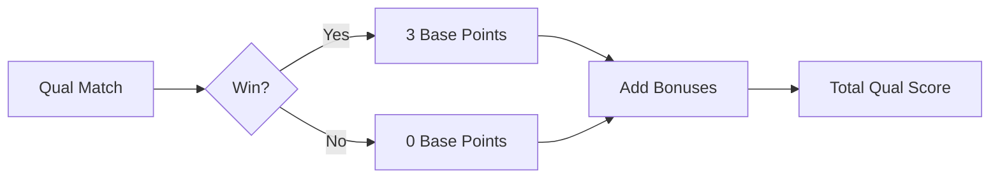
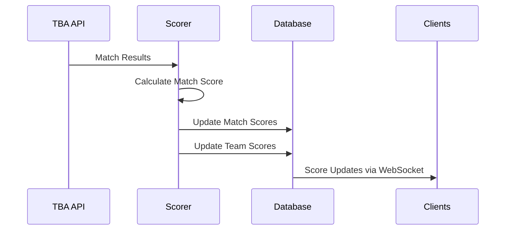

# Scoring Algorithm

> **AI-Generated Documentation**
> This documentation was generated with AI assistance and may contain errors or outdated information. For official guidance, verify with the development team or consult source code.

Complete documentation of the Fantasy FRC scoring system that determines team and player rankings.

## 🎯 Overview

The Fantasy FRC scoring system calculates team scores based on actual FRC competition performance. Each team's total score is the sum of four components:

```
Total Score = Qualification Score + Playoff Score + Alliance Score + Einstein Score
```

## 📊 Score Components

### 1. Qualification Score (`Qual Score`)
Points earned in qualification matches.

**Base Points:**
- **Win**: 3 points to winning alliance
- **Loss/Tie**: 0 points

**Current Season Game Bonuses** (per match):
- Bonuses vary by year's game rules.
- Configurable bonus point constants: `SCORER_ENERGIZED_BONUS_POINTS` (default 1), `SCORER_SUPERCHARGED_BONUS_POINTS` (default 1), `SCORER_TRAVERSAL_BONUS_POINTS` (default 2).

**Example:**

```mermaid
graph LR
    A[Qual Match] --> B{Win?}
    B -->|Yes| C[3 Base Points]
    B -->|No| D[0 Base Points]
    C --> E[Add Bonuses]
    D --> E
    E --> F[Total Qual Score]
```

### 2. Playoff Score (`Playoff Score`)
Points earned in elimination matches (Quarterfinals, Semifinals, Finals).

**Point Values by Match Level:**
| Match Level | Base Points | Upper Bracket | Lower Bracket |
|-------------|--------------|---------------|---------------|
| Quarterfinal (qf) | - | - | - |
| Semifinal (sf) | - | 15 points | 9 points |
| Final (f) | 18 points | - | - |

**Bracket Determination:**
- **Upper Bracket**: Match sets 1, 2, 3, 4, 7, 8, 11
- **Lower Bracket**: Match sets 5, 6, 9, 10, 12, 13

**Einstein Multiplier:**
- All playoff scores at the Einstein Championship event (e.g., `*cmptx*`) are **doubled**

### 3. Alliance Score (`Alliance Score`)
Points based on alliance selection position at championship events.

**Alliance Selection Base Scores:**

The code stores base scores per alliance rank. The final score is the base score multiplied by `SCORER_ALLIANCE_PICK_MULTIPLIER` (default 2).

| Alliance | Captain | 1st Pick | 2nd Pick | 3rd Pick |
|----------|---------|----------|----------|----------|
| 1st | 32 | 31 | 9 | 8 |
| 2nd | 30 | 29 | 10 | 7 |
| 3rd | 28 | 27 | 11 | 6 |
| 4th | 26 | 25 | 12 | 5 |
| 5th | 24 | 23 | 13 | 4 |
| 6th | 22 | 21 | 14 | 3 |
| 7th | 20 | 19 | 15 | 2 |
| 8th | 18 | 17 | 16 | 1 |

**Important Notes:**
- Final scores are base scores × `SCORER_ALLIANCE_PICK_MULTIPLIER` (default 2).
- For example, the 1st alliance captain receives 32 × 2 = 64 points.
- Only applies to championship events (not Einstein).
- Determined by actual alliance selection at events.

### 4. Einstein Score (`Einstein Score`)
Special scoring for Einstein Championship matches.

**Calculation:**
- Uses same playoff scoring rules
- All points are **doubled**
- Only applies to Einstein Championship matches

## 🔢 Score Calculation Examples

### Example 1: Qualification Match
Team wins qualification match with two +1 bonuses:

```
Base Points: 3 (win)
Bonus 1: +1
Bonus 2: +1
Total: 5 points
```

### Example 2: Playoff Match
Team wins upper bracket semifinal at regular event:

```
Base Points: 15 (upper bracket SF)
Einstein Multiplier: x1 (not Einstein)
Total: 15 points
```

### Example 3: Einstein Playoff Match
Team wins lower bracket semifinal at Einstein:

```
Base Points: 9 (lower bracket SF)
Einstein Multiplier: x2
Total: 18 points
```

### Example 4: Alliance Selection
Team selected as 2nd pick by 3rd alliance:

```
Base Score: 27 (from table)
Multiplier: x2
Total: 54 points
```

## 📈 Score Processing Flow


```mermaid
sequenceDiagram
    participant TBA as TBA API
    participant S as Scorer
    participant DB as Database
    participant C as Clients
    
    TBA->>S: Match Results
    S->>S: Calculate Match Score
    S->>DB: Update Match Scores
    S->>DB: Update Team Scores
    DB->>C: Score Updates via WebSocket
```

### Match Processing Order
1. **Qualification Matches** (`*_qm*`)
2. **Quarterfinals** (`*_qf*`)
3. **Semifinals** (`*_sf*`)
4. **Finals** (`*_f*`)
5. **Einstein Matches** (`*{year}cmptx_*`)

## 🏆 Player Score Calculation

Each player's fantasy score is the sum of all their picked teams' total scores:

```
Player Score = Σ(Team Total Scores for all picked teams)
```

### Draft Impact
- **8 players per draft**
- **8 teams per player** (64 total picks)
- **Snake draft order** ensures fair distribution
- **Player ranking** based on total score of all 8 teams

## 🎮 Game-Specific Rules

### Bonus Eligibility
Bonuses vary each season based on the current FRC game rules. Examples from recent seasons include:
- **Auto Bonus**: Autonomous period objectives achieved
- **Barge Bonus**: Barge-related objectives completed
- **Coral Bonus**: Coral placement objectives met

Refer to the current season's game manual for the exact bonus criteria.

### Disqualification Handling
- **DQed Teams**: Receive 0 points for that match
- **Surrogate Teams**: Not counted for scoring
- **Alliance Penalties**: Applied at match level

## 📊 Data Sources and Events

### Supported Events
Events are configured per season and typically include the championship division events plus Einstein. Example event keys follow the pattern `{year}{event_code}`:

```go
Events() []string {
    return []string{
        "{year}arc", // Archimedes
        "{year}cur", // Curie
        "{year}dal", // Daly
        "{year}gal", // Galileo
        "{year}hop", // Hopper
        "{year}joh", // Johnson
        "{year}mil", // Milstein
        "{year}new", // Newton
        "{year}cmptx", // Einstein
    }
}
```

### Match Identification
- **Qualification**: `*_qm*` pattern
- **Playoff**: `*_qf*`, `*_sf*`, `*_f*` patterns
- **Einstein**: `*cmptx_*` pattern

## 🔍 Score Queries

### Database Query Structure
```sql
-- Get team scores by category
SELECT
    CASE 
        WHEN mt.match_tbaId LIKE '%_qm%' THEN 'Qual Score'
        WHEN mt.match_tbaId LIKE '%cmptx%' THEN 'Einstein Score'
        ELSE 'Playoff Score' 
    END AS DisplayName,
    SUM(CASE 
        WHEN mt.Alliance = 'Red' THEN m.redscore 
        WHEN mt.Alliance = 'Blue' THEN m.bluescore 
        ELSE 0 
    END) As Score
FROM Matches_Teams mt
INNER JOIN Matches m ON mt.Match_tbaId = m.tbaId
WHERE mt.Team_TbaId = [TEAM_ID]
AND mt.Isdqed = false
GROUP BY DisplayName
```

## ⚙️ Scoring Service Architecture

### Background Processing
- **Continuous scoring runner** processes match queue
- **Webhook integration** for real-time updates
- **Match queue** prioritizes by competition level

> **Note:** Periodic full rescoring every 6 hours is planned but not currently implemented. Scores are updated when TBA webhooks arrive or when the scoring runner processes queued matches.

### Error Handling
- **Missing match data**: Graceful retry with TBA API
- **Invalid alliances**: Logging and score calculation continuation
- **API failures**: Queue-based retry mechanism

## 🎯 Edge Cases and Special Rules

### Match Replays
- Original match scores are replaced
- Rescoring triggered by webhook updates
- Player scores recalculated automatically

### Team Eligibility
- Teams must participate in configured events
- Alliance selection only at championship events
- Einstein teams must have previous championship participation

### Scoring Disputes
- All scores derived from official TBA data
- Manual override available through admin console
- Audit trail maintained for all score changes

## 📱 Real-Time Updates

### Real-Time Updates

Score changes are not pushed over WebSocket. Clients refresh draft score pages to see updated standings. Draft pick updates use the WebSocket pick notifier; see [WebSocket API](../api/websocket-api.md).

---

*Last updated: 2026-09-04*

*TODO: Add historical scoring examples, edge case handling details, and performance optimization notes*