# Database Schema Visual Guide

Visual representations of Fantasy FRC database structure and relationships.

## 🗄️ Complete Entity Relationship Diagram

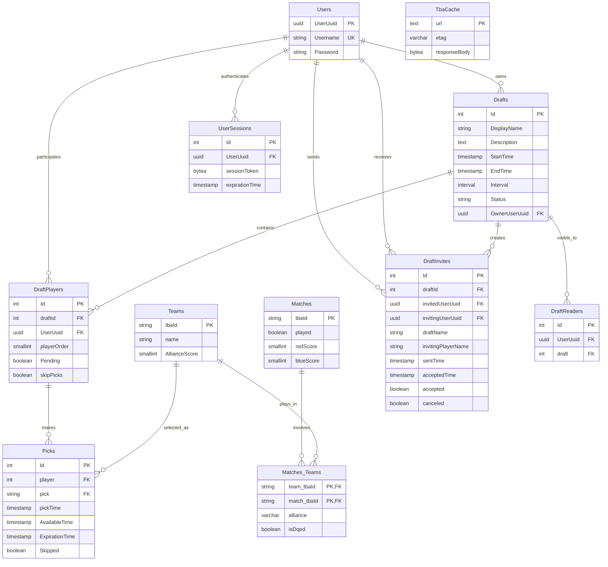

## 📊 Table Relationship Overview

### Core Entity Relationships
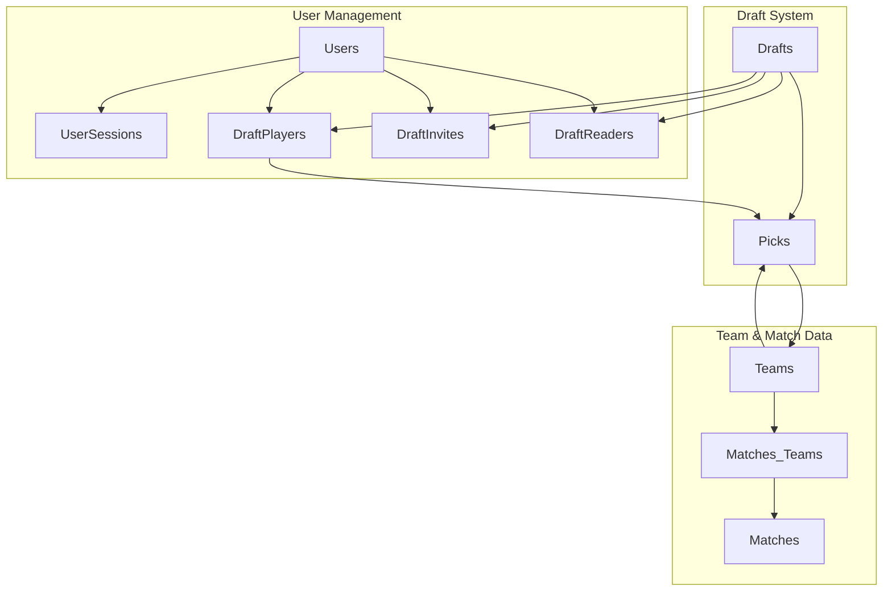

### Draft Lifecycle Flow
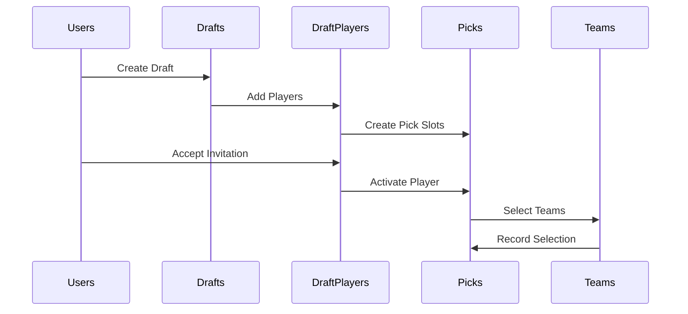

## 🏗️ Schema Evolution Timeline

```mermaid
gantt
    title Database Schema Evolution
    dateFormat X
    axisFormat %s
    
    section Version 1.0
    Basic Tables :active, v1, 0, 2
    User Management :active, v1, 2, 4
    Match Tracking :active, v1, 4, 6
    
    section Version 1.1
    UUID Migration :active, v11, 6, 8
    FK Updates :active, v11, 8, 10
    
    section Version 1.2
    Draft Enhancements :active, v12, 10, 12
    Timing Columns :active, v12, 12, 14
    
    section Version 1.3
    Skip Feature :active, v13, 14, 15
    
    section Version 1.4
    Performance Cache :active, v14, 15, 16
```

## 📈 Data Flow Patterns

### User Registration Flow
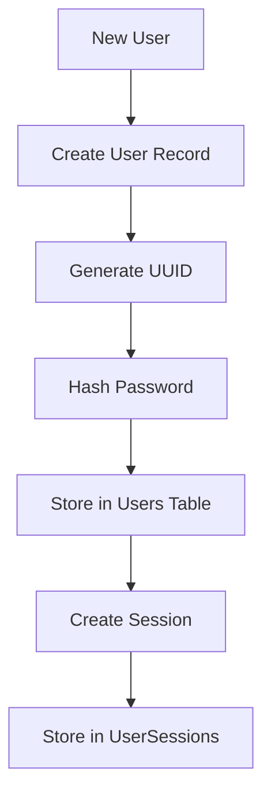

### Draft Creation Flow
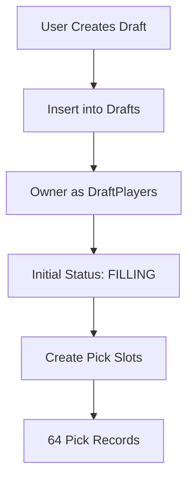

### Pick Processing Flow
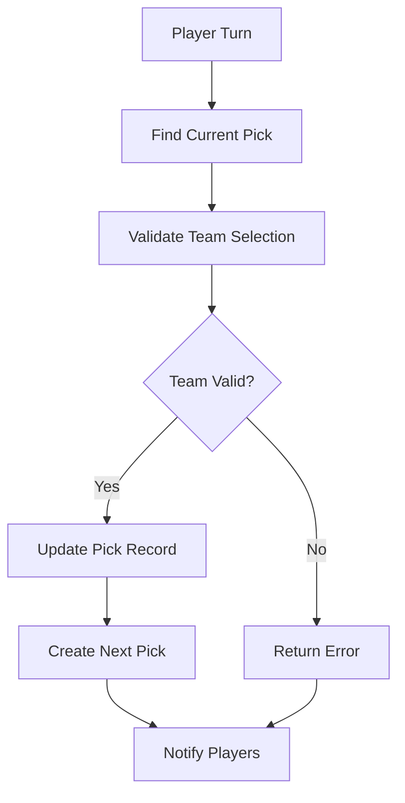

## 🔍 Key Index Patterns

### Primary Key Distribution
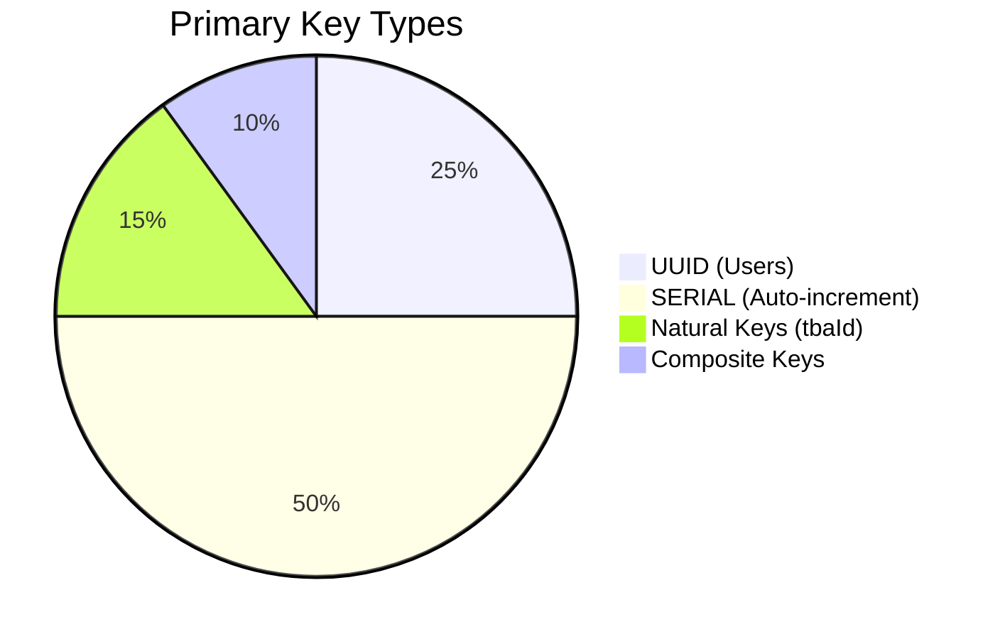

### Foreign Key Relationships
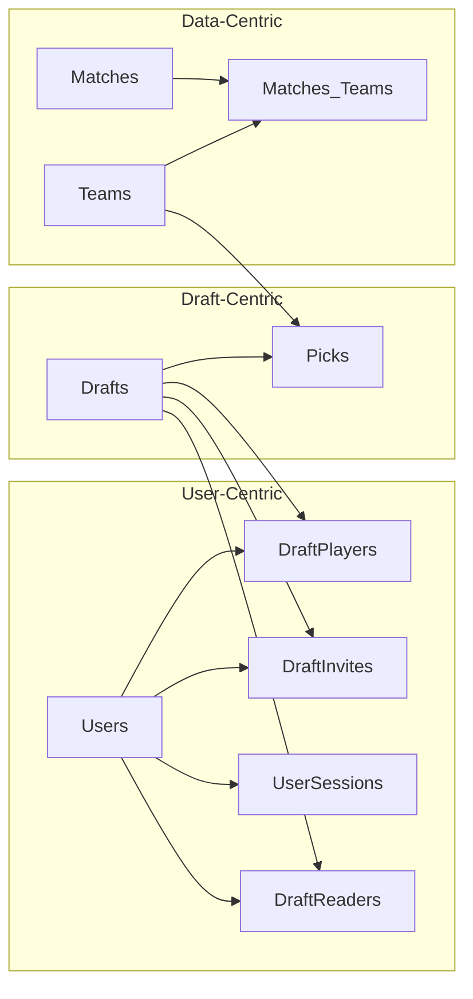

## 📊 Table Size Analysis

### Row Count Distribution
```mermaid
bar-chart
    title Estimated Table Sizes
    x-axis [Users, Teams, Drafts, Players, Picks, Matches]
    y-axis "Rows (thousands)" 0 --> 200
    series [Current]
    data [1, 3.5, 0.5, 4, 32, 50]
```

### Growth Rate Projection
```mermaid
line-chart
    title Monthly Growth Projections
    x-axis [Jan, Feb, Mar, Apr, May, Jun]
    y-axis "Rows" 0 --> 10000
    series [Users, Drafts, Picks, Matches]
    data [1000, 1100, 1200, 1300, 1400, 1500]
    data [50, 100, 150, 200, 250, 300]
    data [3200, 6400, 9600, 12800, 16000, 19200]
    data [5000, 10000, 15000, 20000, 25000, 30000]
```

## 🔒 Security Architecture

### Authentication Flow
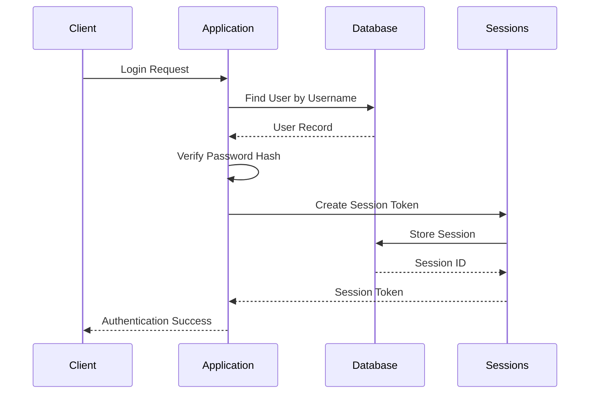

### Data Protection Layers
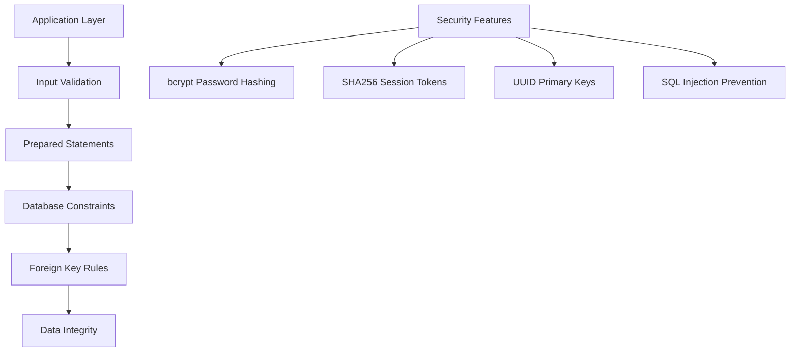

## 🚀 Performance Optimization

### Query Optimization Patterns
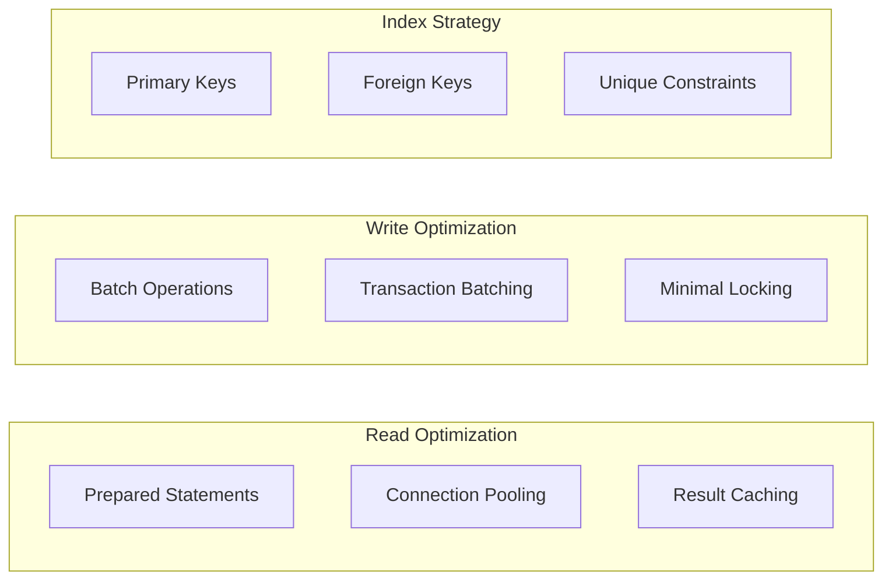

### Cache Implementation
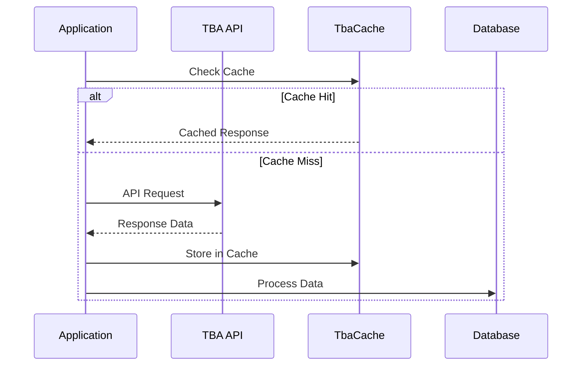

## 📋 Migration Process

### UUID Migration Steps
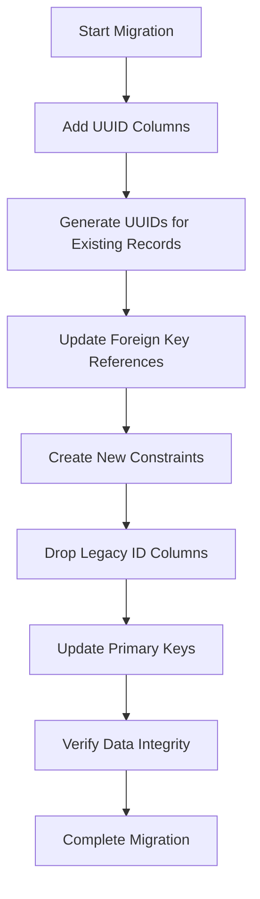

### Schema Versioning
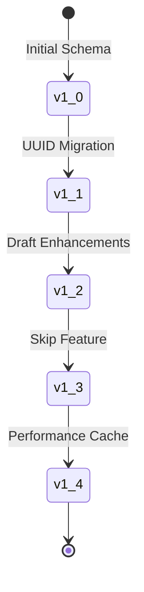

---

*Visual guide complements detailed schema documentation at [schema.md](./schema.md)*