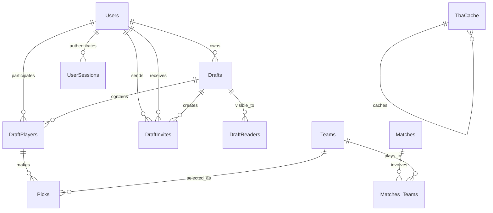
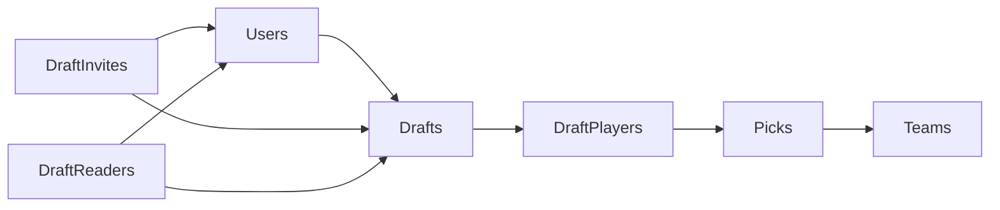
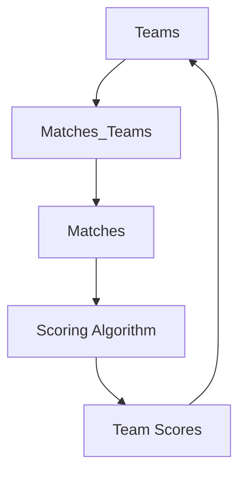

# Database Schema

Complete documentation of Fantasy FRC database structure, relationships, and evolution.

## 🗄️ Overview

The Fantasy FRC database uses **PostgreSQL** with a relational schema supporting user management, draft operations, team scoring, and real-time updates.

## 📋 Core Tables

### 1. Users
**Purpose**: User authentication and profile management.

**Columns**:
| Column | Type | Constraints | Description |
|--------|-------|-------------|-------------|
| `UserUuid` | UUID | PRIMARY KEY | Unique user identifier |
| `Username` | varchar(255) | UNIQUE NOT NULL | Login username |
| `Password` | varchar(100) | NOT NULL | bcrypt hash |

**Indexes**:
- `idx_user_username` on `username` (unique)

**Notes**:
- Migrated from integer ID to UUID for security
- Passwords hashed with bcrypt (cost factor 14)
- No personal data stored beyond username

### 2. Teams
**Purpose**: FRC team information and alliance scores.

**Columns**:
| Column | Type | Constraints | Description |
|--------|-------|-------------|-------------|
| `tbaId` | varchar(10) | PRIMARY KEY | The Blue Alliance team ID |
| `name` | varchar(255) | | Team name |
| `AllianceScore` | smallint | DEFAULT 0 | Alliance selection points |

**Notes**:
- `tbaId` format: "frc" + team number (e.g., "frc1234")
- `AllianceScore` updated from championship alliance selection
- Renamed from `RankingScore` for clarity

### 3. Drafts
**Purpose**: Draft configuration and state management.

**Columns**:
| Column | Type | Constraints | Description |
|--------|-------|-------------|-------------|
| `Id` | SERIAL | PRIMARY KEY | Draft identifier |
| `DisplayName` | varchar(255) | | Draft display name |
| `Description` | TEXT | | Draft description |
| `StartTime` | Timestamp | | Scheduled start time |
| `EndTime` | Timestamp | | Scheduled end time |
| `Interval` | Interval | | Pick time limit |
| `Status` | varchar | | Draft state |
| `OwnerUserUuid` | UUID | FOREIGN KEY | Draft owner |

**Foreign Keys**:
- `OwnerUserUuid` → `Users(UserUuid)`

**Status Values**:
- `"Filling"` - Initial setup phase
- `"Waiting to Start"` - Ready, waiting for start time
- `"Picking"` - Active draft phase
- `"Teams Playing"` - Competition phase
- `"Complete"` - Finished draft

### 4. DraftPlayers
**Purpose**: Player participation and draft order.

**Columns**:
| Column | Type | Constraints | Description |
|--------|-------|-------------|-------------|
| `Id` | SERIAL | PRIMARY KEY | Player record ID |
| `draftId` | int | FOREIGN KEY | Associated draft |
| `UserUuid` | UUID | FOREIGN KEY | Player user |
| `playerOrder` | smallint | | Pick order position |
| `Pending` | boolean | | Invitation status |
| `skipPicks` | boolean | DEFAULT false | Auto-skip preference |

**Foreign Keys**:
- `draftId` → `Drafts(Id)`
- `UserUuid` → `Users(UserUuid)`

**Notes**:
- `playerOrder` determines snake draft sequence
- `skipPicks` allows automatic turn skipping
- `Pending` tracks invitation acceptance

### 5. Picks
**Purpose**: Team selections during draft.

**Columns**:
| Column | Type | Constraints | Description |
|--------|-------|-------------|-------------|
| `Id` | SERIAL | PRIMARY KEY | Pick identifier |
| `player` | int | FOREIGN KEY | Draft player |
| `pick` | varchar(10) | FOREIGN KEY | Selected team |
| `pickTime` | Timestamp | | When pick was made |
| `AvailableTime` | Timestamp | NOT NULL | When pick becomes available |
| `ExpirationTime` | Timestamp | NOT NULL | Pick deadline |
| `Skipped` | boolean | DEFAULT false | Auto-skip flag |

**Foreign Keys**:
- `player` → `DraftPlayers(Id)`
- `pick` → `Teams(tbaId)`

**Notes**:
- `AvailableTime` when player can make pick
- `ExpirationTime` = `AvailableTime` + draft interval
- `Skipped` true for auto or manual skips

### 6. Matches
**Purpose**: FRC match results and scoring.

**Columns**:
| Column | Type | Constraints | Description |
|--------|-------|-------------|-------------|
| `tbaId` | varchar(20) | PRIMARY KEY | Match identifier |
| `played` | boolean | DEFAULT false | Match completed |
| `redScore` | smallint | DEFAULT 0 | Red alliance score |
| `blueScore` | smallint | DEFAULT 0 | Blue alliance score |

**Notes**:
- `tbaId` format: `{event}_{level}_{match}` (e.g., "2025cur_qm1")
- Scores calculated by scoring algorithm
- `played` indicates match has results

### 7. Matches_Teams
**Purpose**: Team participation in matches.

**Columns**:
| Column | Type | Constraints | Description |
|--------|-------|-------------|-------------|
| `team_tbaId` | varchar(10) | FOREIGN KEY | Team ID |
| `match_tbaId` | varchar(20) | FOREIGN KEY | Match ID |
| `alliance` | varchar(4) | | "Red" or "Blue" |
| `isDqed` | boolean | DEFAULT false | Disqualification flag |

**Primary Key**: `(team_tbaId, match_tbaId)`

**Foreign Keys**:
- `team_tbaId` → `Teams(tbaId)` ON UPDATE CASCADE ON DELETE CASCADE
- `match_tbaId` → `Matches(tbaId)` ON UPDATE CASCADE

**Notes**:
- Junction table for many-to-many relationship
- `isDqed` teams receive 0 points for match
- Cascade deletes maintain data integrity

## 🔐 Authentication Tables

### 8. UserSessions
**Purpose**: Secure session management.

**Columns**:
| Column | Type | Constraints | Description |
|--------|-------|-------------|-------------|
| `Id` | SERIAL | PRIMARY KEY | Session record ID |
| `UserUuid` | UUID | FOREIGN KEY | Session owner |
| `sessionToken` | bytea | NOT NULL | SHA256 hash |
| `expirationTime` | Timestamp | NOT NULL | Session expiry |

**Foreign Keys**:
- `UserUuid` → `Users(UserUuid)`

**Notes**:
- `sessionToken` is SHA256 hash, not plain token
- Sessions expire after 10 days
- Automatic cleanup of expired sessions

## 📧 Invitation Tables

### 9. DraftInvites
**Purpose**: Draft invitation tracking.

**Columns**:
| Column | Type | Constraints | Description |
|--------|-------|-------------|-------------|
| `Id` | SERIAL | PRIMARY KEY | Invitation ID |
| `draftId` | int | FOREIGN KEY | Target draft |
| `invitedUserUuid` | UUID | FOREIGN KEY | Invited user |
| `invitingUserUuid` | UUID | FOREIGN KEY | Sender |
| `draftName` | varchar | | Draft display name |
| `invitingPlayerName` | varchar | | Sender username |
| `sentTime` | Timestamp | NOT NULL | When sent |
| `acceptedTime` | Timestamp | | When accepted |
| `accepted` | boolean | | Response status |
| `canceled` | boolean | | Cancellation flag |

**Foreign Keys**:
- `draftId` → `Drafts(Id)`
- `invitedUserUuid` → `Users(UserUuid)`
- `invitingUserUuid` → `Users(UserUuid)`

**Notes**:
- Tracks invitation lifecycle
- Prevents duplicate invitations
- Supports invitation cancellation

### 10. DraftReaders
**Purpose**: Read access control for drafts.

**Columns**:
| Column | Type | Constraints | Description |
|--------|-------|-------------|-------------|
| `Id` | SERIAL | PRIMARY KEY | Reader record ID |
| `UserUuid` | UUID | FOREIGN KEY | Reader user |
| `draft` | int | FOREIGN KEY | Accessible draft |

**Foreign Keys**:
- `UserUuid` → `Users(UserUuid)`
- `draft` → `Drafts(Id)`

**Notes**:
- Provides read-only access to specific drafts
- Used for sharing draft visibility

## 🗄️ Cache Tables

### 11. TbaCache
**Purpose**: API response caching for performance.

**Columns**:
| Column | Type | Constraints | Description |
|--------|-------|-------------|-------------|
| `url` | text | PRIMARY KEY | API endpoint URL |
| `etag` | varchar(255) | | Cache validation header |
| `responseBody` | bytea | | Cached response data |

**Notes**:
- Reduces TBA API calls
- Uses ETag headers for cache validation
- Improves response times

## 🔄 Schema Evolution

### Migration History

#### Version 1.0 (Initial)
- Basic tables: Users, Teams, Drafts, Matches, Matches_Teams
- Simple draft and match tracking

#### Version 1.1 (UUID Migration)
- **File**: `changeUserIdToGuid.sql`
- **Changes**: 
  - Added UUID columns to all user-related tables
  - Migrated data from integer IDs
  - Updated foreign key constraints
  - Dropped legacy ID columns

#### Version 1.2 (Draft Enhancements)
- **Changes**:
  - Added `Status` to Drafts
  - Added `Description`, `StartTime`, `EndTime`, `Interval`
  - Added `DraftReaders` table
  - Enhanced `Picks` with timing columns

#### Version 1.3 (Pick Management)
- **File**: `optInSkip.sql`
- **Changes**:
  - Added `skipPicks` to DraftPlayers
  - Enhanced pick expiration logic

#### Version 1.4 (Performance)
- **File**: `etagUpgrade.sql`
- **Changes**:
  - Added `TbaCache` table
  - Implemented API response caching

## 🔍 Key Relationships

### Draft Flow

### Scoring Flow

## 📊 Data Distribution

### Table Sizes (Typical)
| Table | Rows | Growth Rate |
|-------|-------|-------------|
| Users | 1,000+ | 10/month |
| Teams | 3,500+ | Static (FRC teams) |
| Drafts | 500+ | 50/month |
| DraftPlayers | 4,000+ | 400/month |
| Picks | 32,000+ | 3,200/month |
| Matches | 50,000+ | 5,000/event |
| Matches_Teams | 200,000+ | 20,000/event |

### Index Strategy
- **Primary Keys**: All tables have proper PKs
- **Foreign Keys**: Indexed for join performance
- **Unique Constraints**: Username uniqueness
- **Composite Keys**: Matches_Teams junction table

## 🔒 Security Considerations

### Data Protection
- **Passwords**: bcrypt hashed, never stored plain
- **Sessions**: SHA256 hashed tokens
- **UUIDs**: Prevent sequential ID attacks
- **Input Validation**: All queries use prepared statements

### Access Control
- **Draft Ownership**: Only owners can modify drafts
- **Player Permissions**: Role-based access control
- **Session Management**: Automatic expiration and cleanup

## 🚀 Performance Optimizations

### Query Patterns
- **Prepared Statements**: All queries use parameterization
- **Connection Pooling**: Efficient connection management
- **Batch Operations**: Bulk inserts where possible
- **Index Usage**: Optimized for common queries

### Caching Strategy
- **TBA Cache**: Reduces external API calls
- **Application Cache**: In-memory for frequent access
- **Session Cache**: Fast authentication lookups

---

*TODO: Add query optimization guide, backup procedures, and monitoring queries*