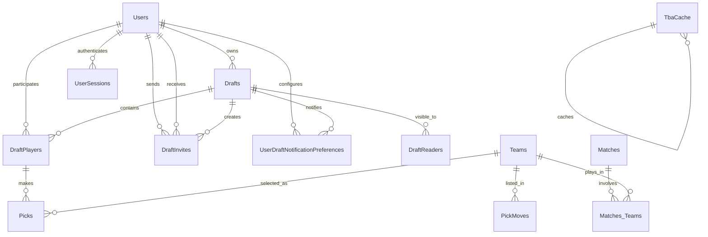
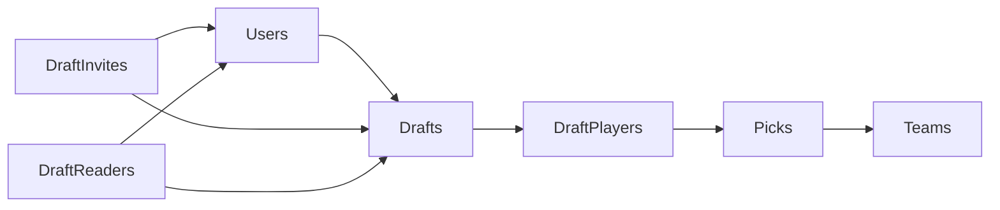
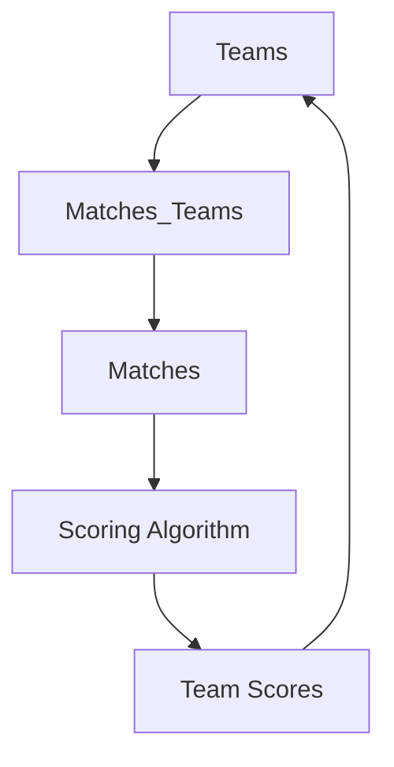

# Database Schema

Complete documentation of Fantasy FRC database structure, relationships, and evolution.

## 🗄️ Overview

The Fantasy FRC database uses **PostgreSQL** with a relational schema supporting user management, draft operations, team scoring, and caching.

```mermaid
erDiagram
    Users ||--o{ Drafts : owns
    Users ||--o{ DraftPlayers : participates
    Users ||--o{ DraftInvites : sends
    Users ||--o{ DraftInvites : receives
    Users ||--o{ UserSessions : authenticates
    Users ||--o{ UserDraftNotificationPreferences : configures
    Drafts ||--o{ DraftPlayers : contains
    Drafts ||--o{ DraftInvites : creates
    Drafts ||--o{ DraftReaders : visible_to
    Drafts ||--o{ UserDraftNotificationPreferences : notifies
    DraftPlayers ||--o{ Picks : makes
    Teams ||--o{ Picks : selected_as
    Teams ||--o{ PickMoves : listed_in
    Matches ||--o{ Matches_Teams : involves
    Teams ||--o{ Matches_Teams : plays_in
    TbaCache ||--o{ TbaCache : caches
```

## 📋 Core Tables

### 1. Users
**Purpose**: User authentication and profile management.

**Columns**:
| Column | Type | Constraints | Description |
|--------|------|-------------|-------------|
| `UserUuid` | UUID | PRIMARY KEY | Unique user identifier |
| `username` | VARCHAR(255) | NOT NULL | Login username |
| `password` | VARCHAR(100) | NOT NULL | bcrypt hash |
| `isAdmin` | BOOLEAN | | Global admin flag |
| `DiscordId` | VARCHAR(50) | | Discord snowflake for notifications |

**Indexes**:
- `idx_user_username` on `username` (unique)

**Notes**:
- User primary keys are UUIDs.
- Passwords hashed with bcrypt (cost factor configurable, default 14).

### 2. Teams
**Purpose**: FRC team information and alliance scores.

**Columns**:
| Column | Type | Constraints | Description |
|--------|------|-------------|-------------|
| `tbaId` | VARCHAR(10) | PRIMARY KEY | The Blue Alliance team ID |
| `name` | VARCHAR(255) | | Team name |
| `allianceScore` | SMALLINT | | Alliance selection points |

**Notes**:
- `tbaId` format: "frc" + team number (e.g., "frc1234").
- `allianceScore` updated from championship alliance selection.

### 3. Drafts
**Purpose**: Draft configuration and state management.

**Columns**:
| Column | Type | Constraints | Description |
|--------|------|-------------|-------------|
| `Id` | SERIAL | PRIMARY KEY | Draft identifier |
| `DisplayName` | VARCHAR(255) | NOT NULL | Draft display name |
| `Description` | TEXT | | Draft description |
| `StartTime` | TIMESTAMPTZ | | Scheduled start time (currently unused) |
| `EndTime` | TIMESTAMPTZ | | Scheduled end time (currently unused) |
| `Status` | VARCHAR | | Draft state |
| `OwnerUserUuid` | UUID | FOREIGN KEY | Draft owner |
| `DiscordWebhook` | VARCHAR(150) | | Optional webhook URL for draft notifications |
| `TimingType` | `timingType` | Enum: `per_pick`, `increment` | Pick timing mode (currently unused) |
| `IncrementTimeSec` | SMALLINT | | Increment timing value in seconds (currently unused) |
| `PerPickExpTimeSec` | SMALLINT | | Per-pick expiration in seconds (currently unused) |

**Foreign Keys**:
- `OwnerUserUuid` → `Users(UserUuid)`

**Status Values**:
- `"Filling"` - Initial setup phase
- `"Waiting to Start"` - Reserved state (not currently used by the state machine)
- `"Picking"` - Active draft phase
- `"Teams Playing"` - Competition phase
- `"Complete"` - Finished draft

**Notes**:
- `Interval` existed historically but was dropped in migration `00007_add_pick_timing.sql`.
- Pick timing is currently driven by the `PICK_WINDOWS_CONFIG_FILE` runtime configuration, not by `Drafts` columns.

### 4. DraftPlayers
**Purpose**: Player participation and draft order.

**Columns**:
| Column | Type | Constraints | Description |
|--------|------|-------------|-------------|
| `Id` | SERIAL | PRIMARY KEY | Player record ID |
| `draftId` | INT | FOREIGN KEY | Associated draft |
| `UserUuid` | UUID | FOREIGN KEY | Player user |
| `playerOrder` | SMALLINT | | Pick order position |
| `skipPicks` | BOOLEAN | DEFAULT FALSE | Auto-skip preference |
| `RemainingPickTimeSec` | INT | | Remaining time for increment-style drafts (currently unused) |

**Foreign Keys**:
- `draftId` → `Drafts(Id)`
- `UserUuid` → `Users(UserUuid)`

**Constraints**:
- `DraftPlayers_draftId_userUuid_unique` UNIQUE (`draftId`, `UserUuid`)

**Notes**:
- `playerOrder` determines snake draft sequence.
- `skipPicks` allows automatic turn skipping.

### 5. Picks
**Purpose**: Team selections during draft.

**Columns**:
| Column | Type | Constraints | Description |
|--------|------|-------------|-------------|
| `Id` | SERIAL | PRIMARY KEY | Pick identifier |
| `player` | INT | FOREIGN KEY | Draft player |
| `pick` | VARCHAR(10) | FOREIGN KEY | Selected team |
| `pickTime` | TIMESTAMPTZ | | When pick was made |
| `AvailableTime` | TIMESTAMPTZ | | When pick becomes available |
| `ExpirationTime` | TIMESTAMPTZ | NOT NULL | Pick deadline |
| `Skipped` | BOOLEAN | DEFAULT FALSE | Auto/manual skip flag |

**Foreign Keys**:
- `player` → `DraftPlayers(Id)`
- `pick` → `Teams(tbaId)`

**Notes**:
- `AvailableTime` is nullable.
- `ExpirationTime` = `AvailableTime` + configured pick duration, adjusted for pick windows.
- `Skipped` true for auto or manual skips.

### 6. PickMoves
**Purpose**: Reserved table for future premove pick-list support.

**Columns**:
| Column | Type | Constraints | Description |
|--------|------|-------------|-------------|
| `Id` | SERIAL | PRIMARY KEY | Record ID |
| `TeamTBAId` | VARCHAR(10) | FOREIGN KEY | Team ID |
| `Status` | VARCHAR(10) | | Premove status |
| `Error` | VARCHAR(255) | | Error message |
| `PickOrder` | SMALLINT | | Intended pick order |

**Foreign Keys**:
- `TeamTBAId` → `Teams(tbaId)` ON UPDATE CASCADE ON DELETE CASCADE

**Notes**:
- Currently no server code references this table.

### 7. Matches
**Purpose**: FRC match results and scoring.

**Columns**:
| Column | Type | Constraints | Description |
|--------|------|-------------|-------------|
| `tbaId` | VARCHAR(20) | PRIMARY KEY | Match identifier |
| `played` | BOOLEAN | | Match completed |
| `redScore` | SMALLINT | | Red alliance score |
| `blueScore` | SMALLINT | | Blue alliance score |

**Notes**:
- `tbaId` format: `{event}_{level}_{match}` (e.g., "2026cur_qm1").
- Scores calculated by the scoring algorithm.

### 8. Matches_Teams
**Purpose**: Team participation in matches.

**Columns**:
| Column | Type | Constraints | Description |
|--------|------|-------------|-------------|
| `team_tbaId` | VARCHAR(10) | FOREIGN KEY | Team ID |
| `match_tbaId` | VARCHAR(20) | FOREIGN KEY | Match ID |
| `alliance` | VARCHAR(4) | | "Red" or "Blue" |
| `isDqed` | BOOLEAN | DEFAULT FALSE | Disqualification flag |

**Primary Key**: `(team_tbaId, match_tbaId)`

**Foreign Keys**:
- `team_tbaId` → `Teams(tbaId)` ON UPDATE CASCADE ON DELETE CASCADE
- `match_tbaId` → `Matches(tbaId)` ON UPDATE CASCADE

**Notes**:
- Junction table for many-to-many relationship.
- `isDqed` teams receive 0 points for the match.

## 🔐 Authentication Tables

### 9. UserSessions
**Purpose**: Secure session management.

**Columns**:
| Column | Type | Constraints | Description |
|--------|------|-------------|-------------|
| `Id` | SERIAL | PRIMARY KEY | Session record ID |
| `UserUuid` | UUID | FOREIGN KEY | Session owner |
| `sessionToken` | BYTEA | NOT NULL | SHA256 hash |
| `expirationTime` | TIMESTAMPTZ | NOT NULL | Session expiry |

**Foreign Keys**:
- `UserUuid` → `Users(UserUuid)`

**Notes**:
- `sessionToken` is SHA256 hash, not plain token.
- Sessions expire after `SESSION_EXPIRATION_DAYS` (default 10 days).
- Automatic cleanup of expired sessions by the background cleanup service.

## 📧 Invitation Tables

### 10. DraftInvites
**Purpose**: Draft invitation tracking.

**Columns**:
| Column | Type | Constraints | Description |
|--------|------|-------------|-------------|
| `Id` | SERIAL | PRIMARY KEY | Invitation ID |
| `draftId` | INT | FOREIGN KEY | Target draft |
| `InvitedUserUuid` | UUID | FOREIGN KEY | Invited user |
| `InvitingUserUuid` | UUID | FOREIGN KEY | Sender |
| `sentTime` | TIMESTAMPTZ | NOT NULL | When sent |
| `acceptedTime` | TIMESTAMPTZ | | When accepted |
| `Status` | `inviteStatus` | NOT NULL | `pending`, `accepted`, `declined`, or `canceled` |

**Foreign Keys**:
- `draftId` → `Drafts(Id)`
- `InvitedUserUuid` → `Users(UserUuid)`
- `InvitingUserUuid` → `Users(UserUuid)`

**Indexes**:
- `DraftInvites_draftId_invitedUserUuid_pending_unique` partial unique index on (`draftId`, `InvitedUserUuid`) WHERE `Status = 'pending'`

**Notes**:
- Tracks invitation lifecycle.
- Prevents duplicate pending invitations.
- `accepted` and `canceled` boolean columns were replaced by `Status` in migration `00005_draftinvite_status.sql`.

### 11. DraftReaders
**Purpose**: Read access control for drafts.

**Columns**:
| Column | Type | Constraints | Description |
|--------|------|-------------|-------------|
| `Id` | SERIAL | PRIMARY KEY | Reader record ID |
| `UserUuid` | UUID | FOREIGN KEY | Reader user |
| `draft` | INT | FOREIGN KEY | Accessible draft |

**Foreign Keys**:
- `UserUuid` → `Users(UserUuid)`
- `draft` → `Drafts(Id)`

**Notes**:
- Provides read-only access to specific drafts.

### 12. UserDraftNotificationPreferences
**Purpose**: Per-user, per-draft Discord notification opt-ins.

**Columns**:
| Column | Type | Constraints | Description |
|--------|------|-------------|-------------|
| `UserUuid` | UUID | FOREIGN KEY, PRIMARY KEY | User |
| `DraftId` | INT | FOREIGN KEY, PRIMARY KEY | Draft |
| `UpcomingMatch` | BOOLEAN | NOT NULL DEFAULT FALSE | Notify before upcoming matches |
| `PickTurn` | BOOLEAN | NOT NULL DEFAULT FALSE | Notify when it is the user's pick |

**Foreign Keys**:
- `UserUuid` → `Users(UserUuid)` ON DELETE CASCADE
- `DraftId` → `Drafts(Id)` ON DELETE CASCADE

**Indexes**:
- `idx_user_draft_notification_preferences_draft` on `DraftId`

## 🗄️ Cache Tables

### 13. TbaCache
**Purpose**: API response caching for performance.

**Columns**:
| Column | Type | Constraints | Description |
|--------|------|-------------|-------------|
| `url` | TEXT | PRIMARY KEY | API endpoint URL |
| `etag` | VARCHAR(255) | | Cache validation header |
| `responseBody` | BYTEA | | Cached response data |

**Notes**:
- Reduces TBA API calls.
- Uses ETag headers for cache validation.

## 🔄 Schema Evolution

### Migration History

Migrations are managed with [goose](https://github.com/pressly/goose) in `database/migrations/`.

| Migration | File | Description |
|-----------|------|-------------|
| 00001 | `00001_baseline.sql` | Combined current schema: Users, Teams, Drafts, Matches, Matches_Teams, DraftPlayers, DraftInvites, Picks, UserSessions, DraftReaders, TbaCache. |
| 00002 | `00002_add_discord_fields.sql` | Adds `DiscordWebhook` to Drafts and `DiscordId` to Users. |
| 00003 | `00003_premove_pick_list.sql` | Creates `PickMoves` table for future premove support. |
| 00004 | `00004_timezone_timestamptz.sql` | Converts timestamp columns to `TIMESTAMPTZ`. |
| 00005 | `00005_draftinvite_status.sql` | Replaces `accepted`/`canceled` booleans with `Status` enum. |
| 00006 | `00006_draft_invite_player_constraints.sql` | Adds unique constraints preventing duplicate draft players and duplicate pending invites. |
| 00007 | `00007_add_pick_timing.sql` | Adds `TimingType`, `IncrementTimeSec`, `PerPickExpTimeSec` to Drafts and `RemainingPickTimeSec` to DraftPlayers; drops `Interval`. |
| 00008 | `00008_add_user_draft_notification_preferences.sql` | Creates `UserDraftNotificationPreferences` table. |

Archived ad-hoc SQL scripts are kept in `database/archive/` for reference only.

## 🔍 Key Relationships

### Draft Flow

```mermaid
graph LR
    A[Users] --> B[Drafts]
    B --> C[DraftPlayers]
    C --> D[Picks]
    D --> E[Teams]

    F[DraftInvites] --> B
    F --> A

    G[DraftReaders] --> B
    G --> A
```

### Scoring Flow

```mermaid
graph TD
    A[Teams] --> B[Matches_Teams]
    B --> C[Matches]
    C --> D[Scoring Algorithm]
    D --> E[Team Scores]
    E --> A
```

## 📊 Data Distribution

### Table Sizes (Typical)
| Table | Rows | Growth Rate |
|-------|------|-------------|
| Users | 1,000+ | 10/month |
| Teams | 3,500+ | Static (FRC teams) |
| Drafts | 500+ | 50/month |
| DraftPlayers | 4,000+ | 400/month |
| Picks | 32,000+ | 3,200/month |
| Matches | 50,000+ | 5,000/event |
| Matches_Teams | 200,000+ | 20,000/event |

### Index Strategy
- **Primary Keys**: All tables have proper PKs.
- **Foreign Keys**: Indexed for join performance.
- **Unique Constraints**: Username uniqueness, unique draft player pairs, unique pending invites.
- **Composite Keys**: Matches_Teams junction table.

## 🔒 Security Considerations

### Data Protection
- **Passwords**: bcrypt hashed, never stored plain.
- **Sessions**: SHA256 hashed tokens.
- **UUIDs**: Prevent sequential ID attacks.
- **Input Validation**: All queries use prepared statements.

### Access Control
- **Draft Ownership**: Only owners can modify drafts.
- **Player Permissions**: Role-based access control.
- **Session Management**: Automatic expiration and cleanup.

## 🚀 Performance Optimizations

### Query Patterns
- **Prepared Statements**: All queries use parameterization.
- **Connection Pooling**: Efficient connection management.
- **Batch Operations**: Bulk inserts where possible.
- **Index Usage**: Optimized for common queries.

### Caching Strategy
- **TBA Cache**: Reduces external API calls.
- **Avatar Cache**: Redis-backed team avatar caching.
- **Session Cache**: Database-backed session lookups.

---

*Last updated: 2026-09-04*

*TODO: Add query optimization guide, backup procedures, and monitoring queries*
